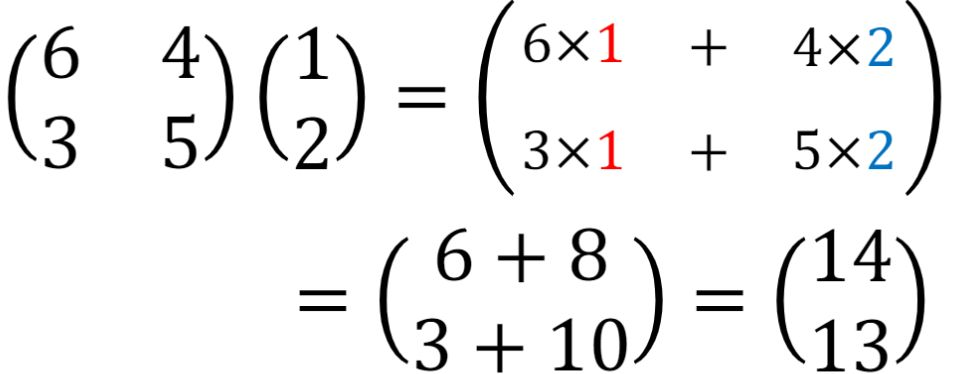
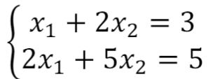
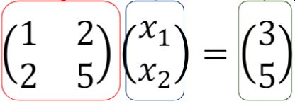
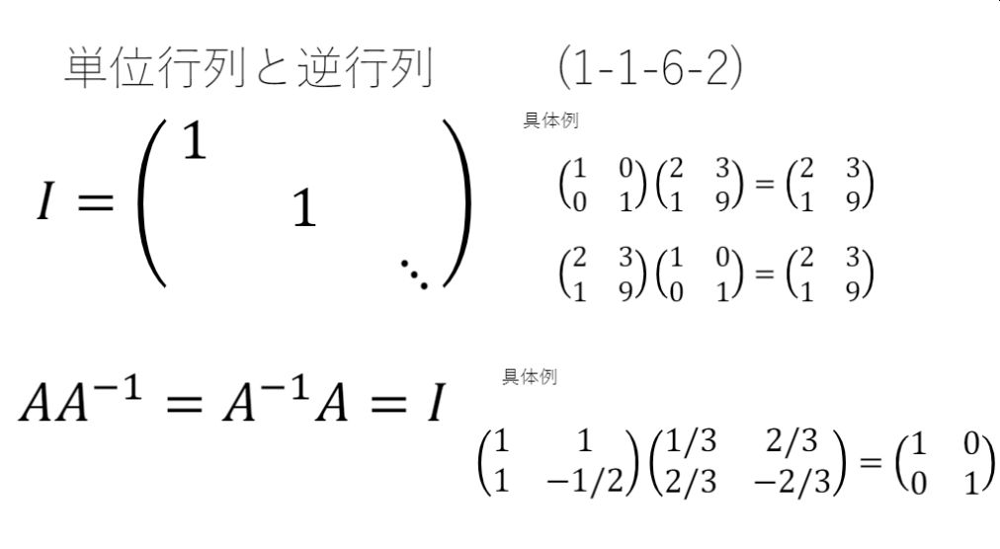
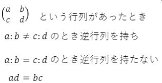
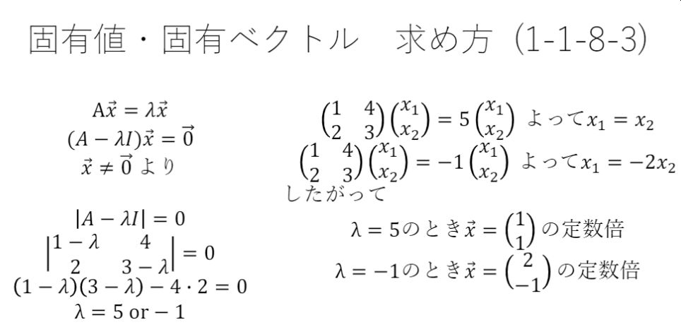
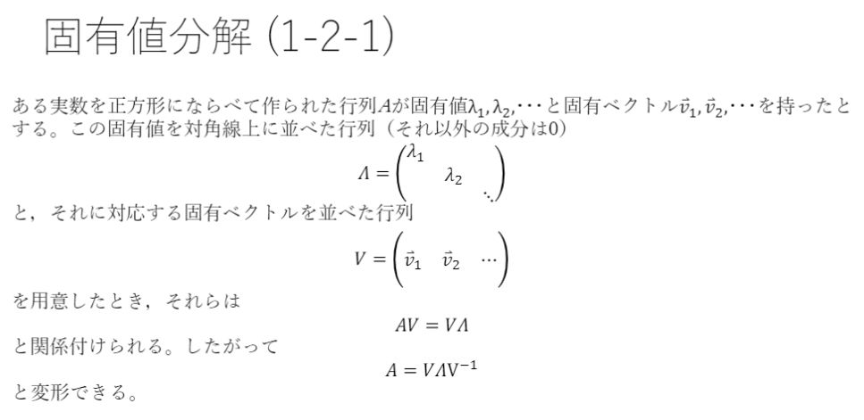
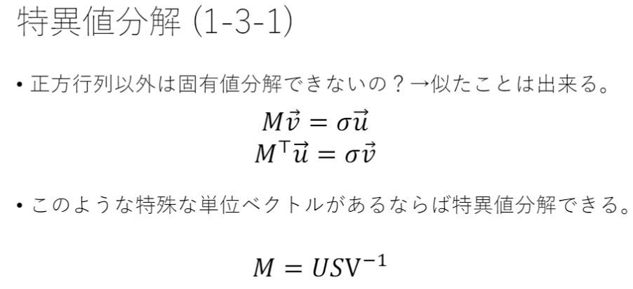
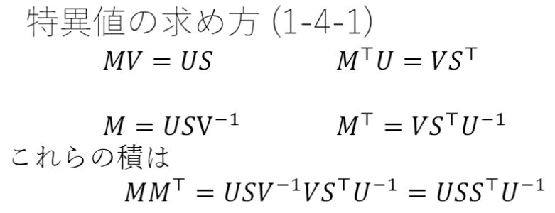

# 第一章 線形代数

 

## 目的
### 1) 固有値・固有ベクトルの求め方を確認する

### 2) 固有値分解について理解を深める

### 3)  特異値・特異ベクトルの概要を知る

### 4) 特異値分解の概要を知る

 

## レポート

### 行列とは
1. スカラーを表にしたもの
1. ベクトルを並べたもの

スカラーとは・・・普通の数、大きさを示す 
ベクトルとは・・・大きさと方向を示す

 

行列とベクトルの積

 

 

以下の連立方程式を行列で表示することができる

 

 

行列による表示

 

 

### 逆行列とは
かけると単位行列になる行列

 

 

### 逆行列が存在しない条件

 

 

### 固有値・固有ベクトル求め方

 

 

### 固有値分解

 

 

### 特異値分解

 

 

## 気づき
1. 特異値分解で、転置行列・逆行列・対称行列についての勉強が必要だった。 
学習には以下のサイトが参考になった。
[転置行列の基本的な４つの性質と証明](https://manabitimes.jp/math/1046)
1. 固有値・固有ベクトルの計算はミスしやすい。計算後の確認に以下のサイトが便利だった。 
[行列固有値、固有ベクトル計算ツール](https://cattech-lab.com/science-tools/eigenvalue/)

