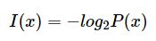
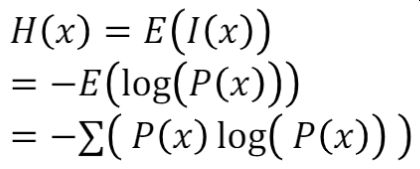
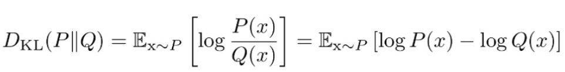
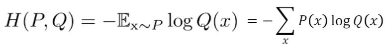

# 第三章 情報理論 

 

## 目的
### 1) 自己情報量・シャノンエントロピーの定義を確認する

### 2) KLダイバージェンス・交差エントロピーの概要を知る

 

# レポート

logを使っていると情報量を表している、という考え方もある

## 自己情報量

- logの底数が 2 なので単位はbit、と覚えておく
- 自己情報量が「確率の関数」・「減少関数」・「加法性」の３つの性質を持って下記で表現した関数がちょうど３つの性質を満たすため、このように定義した

 

 

## シャノン・エントロピー

- 自己情報量の期待値
- 値が最大になる変数を探す

 

 

## カルバック・ライブラー（KL）ダイバージェンス

- 同じ事象・確率変数における異なる確率分布P(x)、Q(x)の違いを表す

 

 

## 交差エントロピー

- Q(x)についての自己情報量をP(x)の分布で平均したもの

 

 

---

# 気づき
- P(x)、Q(x)の確率が同じ値であるとき、KLダイバージェンス値は0になる 

