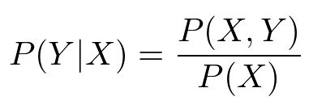
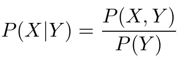
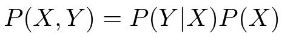
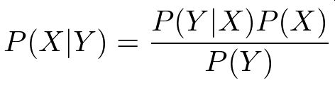
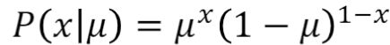
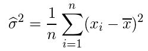

# 応用数学 第二章 確率・統計 

 

## 目的
### 1) 条件付き確率について理解を深める。

### 2) ベイズ則の概要を知る。

### 3) 期待値・分散の求め方を確認する

### 4) 様々な確率分布の概要を知る

 

# レポート

- 機械学習を理解するには統計学の数学の知識が必須

 

## 集合

よく使うが忘れやすい知識の整理

- A ∩ B・・・積集合、AかつB
- A∪B・・・和集合、AまたはB
- B \ A・・・A以外かつB（相対補）

 

成り立つ等式 
- P(A∪B) = P(A) + P(B) - P(A ∩ B)

 

## 条件付き確率とベイズの定理

 

 

 

 

- それぞれの式の意味
    - P(Y|X)・・・条件Xのもとで結果Yが起きる確率
    - P(X|Y)・・・条件Yのもとで結果Xが起きる確率
    - P(X,Y)・・・XとYが同時に起きる確率
    - P(X)　・・・Xが起きる確率
    - P(Y)　・・・Yが起きる確率

 

以上の3つの等式を元に変形した以下の等式がベイズの定理

 

## 記述統計と推測統計

- 記述統計・・・集団の性質を要約し記述する
- 推測統計・・・集団から一部を取り出し元の集団（母集団）の性質を推測する

## 確率変数と確率分布

- 確率変数・・・事象と結び付けられた数値
- 確率分布・・・事象の発生する確率の分布

## 期待値・分散・共分散・標準偏差

- 期待値　・・・ありえそうな値
- 分散　　・・・データの散らばり具合
- 共分散　・・・2つのデータ系列の傾向の違い
- 標準偏差・・・データの平均値周辺での散らばり具合

## 様々な確率分布例
- ベルヌーイ分布・・・確率 p で 1 を、確率 q = 1 − p で 0 をとる離散確率分布

 

 

## 推定量と推定値

- 推定量・・・パラメータを推定するために利用する数値
- 推定値・・・実際に試行した結果から計算した値

## 標本

- 標本平均・・・母集団から取り出した標本の平均値
- 標本分散・・・母集団から取り出した標本の分散

 

 

---

# 気づき
- ベイズの定理を、定理だけで理解するのは困難。たくさんの例題を通じていろんなパターンを学習する必要がある。 
- ベイズの定理の分母部分の計算と考え方に一時期困った。「ベイズ 事前確率」で検索すると比較的ヒットしやすい。 
[事前確率と事後確率]](https://bellcurve.jp/statistics/course/6446.html)

