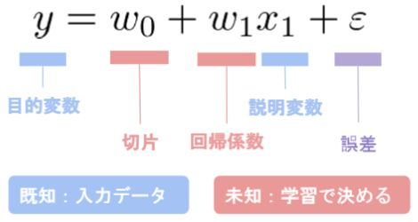
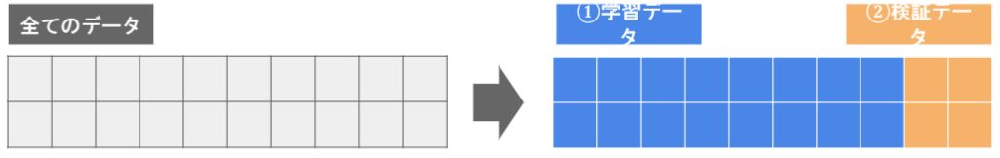
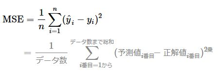
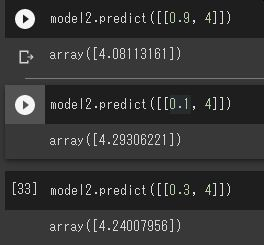

# 機械学習 第一章 線形回帰 

## 回帰問題

- ある入力（離散あるいは連続値）から出力（連続値）を予測する問題
- 線形回帰・・・一次関数で予測
- 非線形回帰・・・一次関数以外の曲線で予測

## 線形回帰モデル

- 教師あり学習
- 入力とm次元パラメータの線形結合を出力

説明変数が1次元の場合（m=1)、単回帰モデルと呼ぶ

 

 

## データの分割とモデルの汎化性能測定

- 学習用データ・・・機械学習モデルの学習に利用するデータ
- 検証用データ・・・学習済みモデルの精度を検証するためのデータ

 

 

### なぜ分割？

- モデルの汎化性能を測定するため
- データへの当てはまりの良さではなく、未知のデータに対してどれくらい精度が高いかを測りたい

### 線形回帰モデルのパラメータは最小二乗法で推定
- MSEがよく使われる

 

 

---

# ハンズオン

- Scikit-learn（サイキット・ラーン）というライブラリを使用

## 課題
- 部屋数が4で犯罪率が0.3の物件はいくらになるか？

### 意識すること
- 内挿／外挿（Interpolation／Extrapolation）を意識する
    - 内挿・・・訓練データ（入力データおよび教師ラベル）の数値の範囲内で出力を求める
    - 外挿・・・訓練データの数値の範囲外で求める

### 実践

- 犯罪率を変えながら出力したが、それほど価格には影響がないとわかった。

 

 

---

# 気づき
- Scikit-learnをサイキット・ラーンと読むのを始めて知った。意外とこんな人いるのではないかと。 

