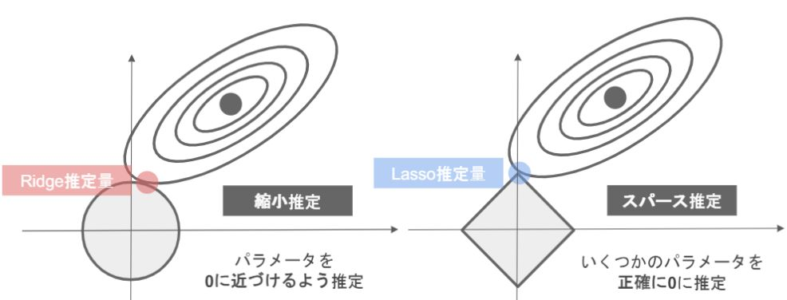
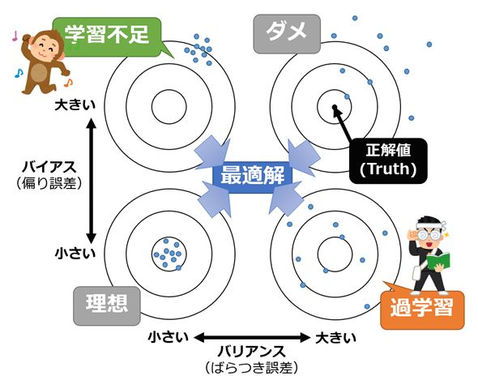
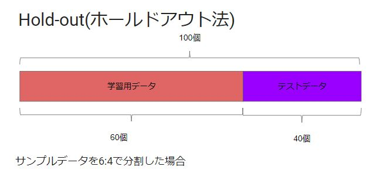
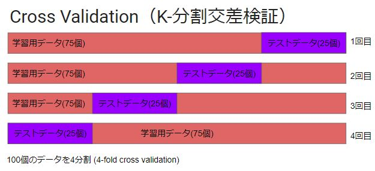
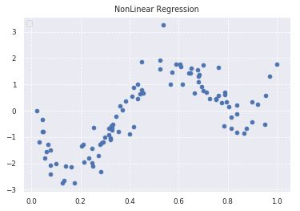
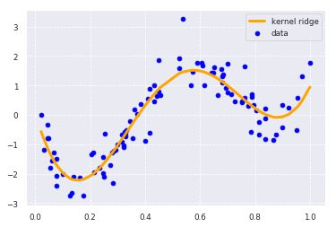
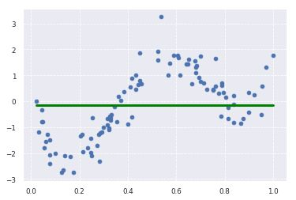
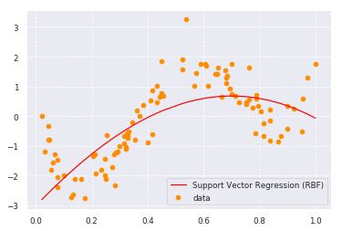
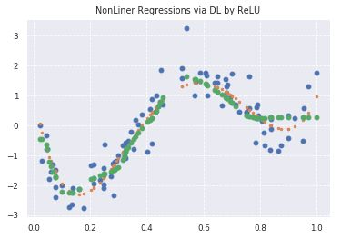

# 機械学習 第二章 非線形回帰 

## 非線形回帰モデル

- 線形でデータの構造を捉えられる場合は限られる
- ただし次数が多ければ（モデルが複雑であればあるほど）よいというものではない
    - 未学習（underfitting）
        - モデルの表現力（複雑さ、次数が多い）< 学習データ
    - 過学習（overfitting）
        - モデルの表現力 > 学習データ

## 正則化法(罰則化法)

- 「モデルの複雑さに伴って、その値が大きくなる正則化項(罰則項)を課した関数」を最小化

### 正則化の例
- リッジ回帰（L2正則化）とラッソ回帰（L1正則化）

 

 

## 汎化性能
- 学習に使用した入力だけでなく、これまで見たことのない新たな入力に対する予測性能
- バイアスとバリアンスのトレードオフ
    - バイアス・・・予測値と真の値（＝正解値）とのズレ（つまり「偏り誤差：Bias error」）
    - バリアンス・・・予測値の広がり（つまり「ばらつき誤差：Variance error」）

 

 

## ホールドアウト法とクロスバリデーション法

- 有限のデータを学習用とテスト用に分割し、「予測精度」や「誤り率」を推定する為に使用
- 分割方法とテスト方法に違いがある
- ホールドアウト法の場合はデータにばらつきがある、データが少ない場合は高精度が出しにくいが、時間は短時間で済む

 

 

 

---

# ハンズオン
- 与えられたデータを使用して様々な機械学習モデルにより学習、結果を表示

 

 

 

 

 

 

---

# 気づき
- ホールドアウトとクロスバリデーションを比較すると、何でもクロスバリデーションでいいのではないか、というのは初学者共通の思いの様子。実際にデータサイエンティストの人に聞くとホールドアウトの重要性を説く人が多い。
- リッジ回帰による正則化では重みを増やすと0に近づくがは完全に0にはならない
- ラッソ回帰による正則化では重みを増やすと完全に0になる
