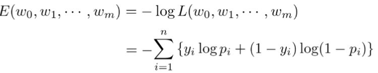

# 機械学習 第三章 ロジスティック回帰

- 教師あり学習
- 分類問題を解くための機械学習モデル
- 入力とm次元パラメータの線形結合をシグモイド関数に入力
- 出力はy=1になる確率の値になる

## シグモイド関数
- x係数、切片の値に関わらず0から1の値になる

 

 

- シグモイド関数の微分は、シグモイド関数自身で表現することが可能

 

 

 

## 最尤推定

- 尤度関数とは
    - データは固定し、パラメータを変化させる
    - 尤度関数を最大化するようなパラメータを選ぶ推定方法を最尤推定という

- 尤度関数を最大とするパラメータを探す(推定)
    - 対数をとると微分の計算が簡単
    - 同時確率の積が和に変換可能
    - 指数が積の演算に変換可能

 

 

## 勾配降下法(Gradient descent)
- 反復学習によりパラメータを逐次的に更新するアプローチの一つ
- ηは学習率と呼ばれるハイパーパラメータでモデルのパラメータの収束しやすさを調整

 

 

## 確率的勾配降下法(SGD)
- データを一つずつランダムに(「確率的」に)選んでパラメータを更新
- 勾配降下法でパラメータを1回更新するのと同じ計算量でパラメータをn回更新できるので、効率よく最適な解を探索可能

 

 

---

# ハンズオン

- 設定
    - タイタニックの乗客データを利用しロジスティック回帰モデルを作成
    - 特徴量抽出をしてみる
- 課題
    - 年齢が30歳で男の乗客は生き残れるか？
- 結果
    - 男性はPclass + Genderの値が2 or 3 or 4に限られる
    - 図より、社会階級highの場合は生き残る、middleとlowの場合は生き残れないと判定

 

 

---

# 気づき
- Scikit-learnをサイキット・ラーンと読むのを始めて知った。意外とこんな人いるのではないかと。
- タイタニックの問題、もっと工夫すべきところなかっただろうか、とか思ったがハンズオンの簡易的な課題であることを思い出した。

