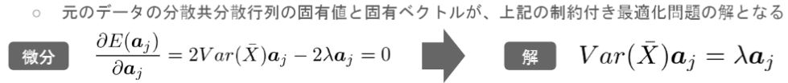

# 機械学習 第四章 主成分分析

- 教師なし学習
- 次元削減
    - 高次元のデータからできるだけ情報を保存するように低次元のデータに変換する
- 多変量データの持つ構造をより少数個の指標に圧縮
- 変量の個数を減らすことに伴う、情報の損失はなるべく小さくしたい
- 少数変数を利用した分析や可視化(2・3次元の場合)が実現可能

## ラグランジュ関数

 

 

- ラグランジュ関数を微分して最適解を求める

 

 

## 寄与率

- 第1~元次元分の主成分の分散は、元のデータの分散と一致
    - 2次元のデータを2次元の主成分で表示した時、固有値の和と元のデータの分散が一致
    - 第k主成分の分散は主成分に対応する固有値

 

 

- 寄与率：第k主成分の分散の全分散に対する割合(第k主成分が持つ情報量の割合)
- 累積寄与率：第1-k主成分まで圧縮した際の情報損失量の割合

---

# ハンズオン

- 設定
    - 乳がん検査データを利用しロジスティック回帰モデルを作成
    - 主成分を利用し2次元空間上に次元圧縮
- 課題
    - 32次元のデータを2次元上に次元圧縮した際に、うまく判別できるかを確認

## 結果

- 各主成分の情報量
    - 30次元データでの正解率は約97%
    - 第1主成分：約43%、第2主成分：約19%ほどある
        - この2つだけでうまくいきそう？

 

 

- 2次元に圧縮したデータだけをプロット
    - 良性は○でマーク、悪性は△でマーク
    - 重なりがあるのでそれほどうまく分けられていないのがわかる

 

 

---

# 気づき
- 仕組みは理解できたが、ライブラリの機能が強力すぎて、中で数学的に何をやっているかがあまり理解できていない。試験前に復習必要。

