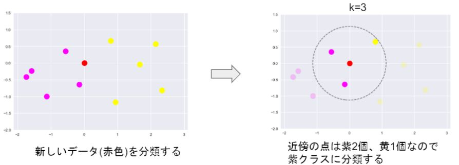
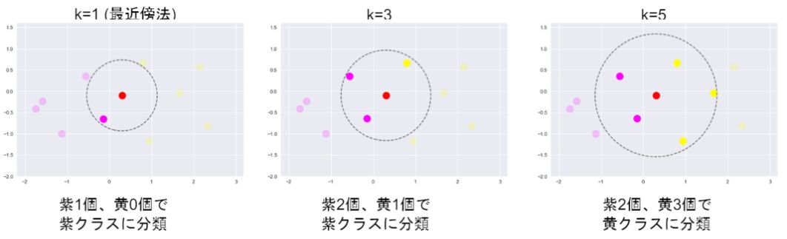
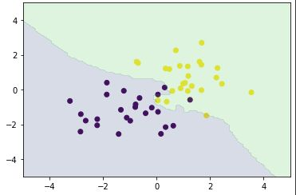
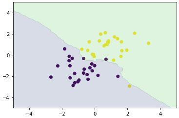
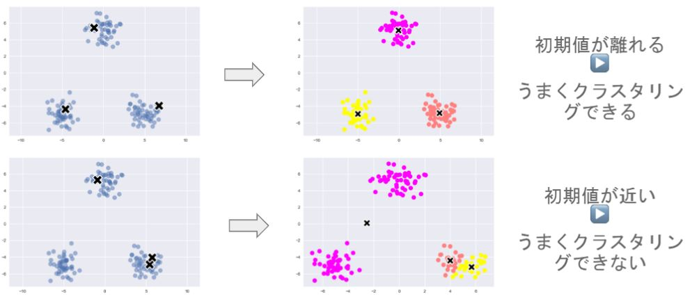
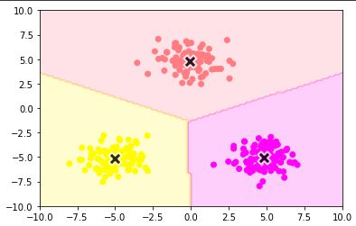

# 機械学習 第五章 （その他の）アルゴリズム

## k近傍法

- 教師あり学習
- 分類問題のための機械学習モデル
- 最近傍のデータを個取ってきて、それらがもっとも多く所属するクラスに識別

 

 

- kを変化させると結果も変わる

 

 

---

# ハンズオン

- 設定
    - 人口データを分類
- 課題
    - 人口データと分類結果をプロット

## 結果

- k = 3

 

 

- k = 5

 

---

## k-means

### 特徴
- 教師なし学習
- クラスタリング手法
- 与えられたデータをk個のクラスタに分類する

### アルゴリズム
- 1) 各クラスタ中心の初期値を設定する
- 2) 各データ点に対して、各クラスタ中心との距離を計算し、最も距離が近いクラスタを割り当てる
- 3) 各クラスタの平均ベクトル（中心）を計算する
- 4) 収束するまで2, 3の処理を繰り返す

 

中心の初期値を変えるとクラスタリング結果も変わりうる

 

 

---

# ハンズオン

- np_kmeans.ipynbによるプロット表示

 

 

---

# 気づき
- k近傍法の概念が初めどのサイトを見ても全然わからなかったが、以下の質問サイトを見て急に理解できた。新鮮な気分だった。 
[「k-近傍法」において](https://detail.chiebukuro.yahoo.co.jp/qa/question_detail/q11224573111)

