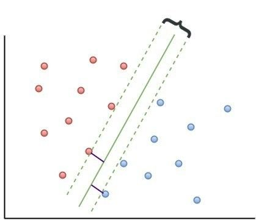
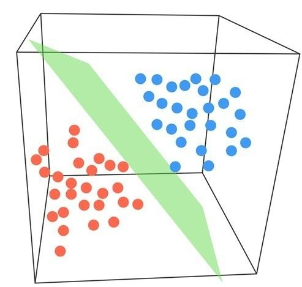
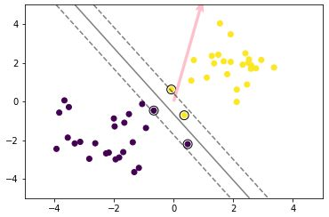
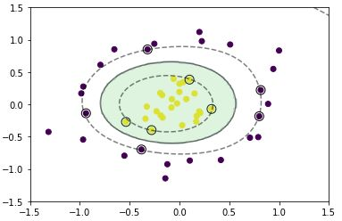
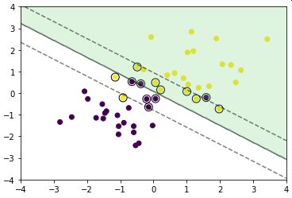

# 機械学習 第六章 サポートベクターマシン

## サポートベクターマシン（SVM）

- 教師あり学習
- 分類問題のための機械学習モデル
- 決定境界によりグループを分離
- 決定境界から最近傍のデータをサポートベクトルと呼ぶ
- 決定境界からサポートベクトルまでのユークリッド距離をマージンと呼ぶ

2次元の場合のSVM

 

 

3次元の場合のSVM

 

 

- SVMでは、正しい直線（分類基準）を見出すために「マージン最大化」という手法を使う
- ハードマージン
    - 決系境界を100%、入力データに合うように設計する
    - 誤差のようなデータがあると精度が落ち、過学習となる。
- ソフトマージン
    - 境界からできるだけ遠いサポートベクトルを用いつつも、誤認識データも少なく設計する

 

### カーネルトリック
- 学習データに含まれる特徴ベクトルを高次元に非線形変換して、その空間で線形の識別を行う機械学習の手法
- 実際のデータは多次元である場合が多いので、その場合の計算コストを下げるときに使用する

---

# ハンズオン

- np_svm.ipynbを実行

## 結果

 

 

 

 

---

# 気づき
- 現在でもよく使用される機械学習モデルなだけあり、ボリュームの多い分野だった。
- カーネルトリックの概念は理解したが、数学的にどうするかは確認問題でも実施していないので早いうちに学習しておきたい。

