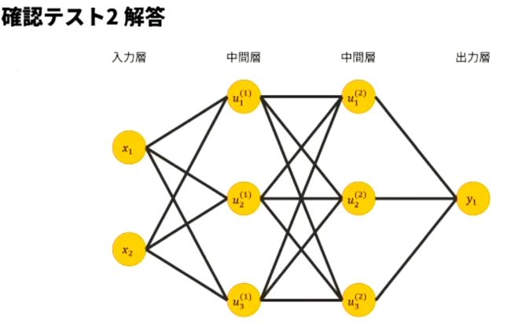
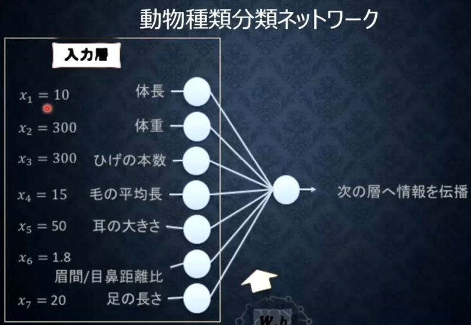
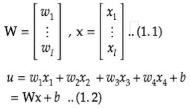

# 深層学習Day1 第一章 入力層～中間層

## ニューラルネットワーク

- 入力データを重みとバイアスを使って変換、出力データを示す

## 確認テスト1
- ディープラーニングは何をしようとしているか？
    - 明示的なプログラムの代わりに多数の中間層を持つニューラルネットワークを用いて、入力値から目的とする出力値に変換する数学モデルを構築すること。
- 最適化の最終目的
    - ③重み[W]
    - ④バイアス[b]
- 考察
    - 機械学習モデルがニューラルネットワークに限定されているが他にはない？
        - そもそもニューラルネットワーク(NN)を発展させてできたのがディープラーニング(DNN)である
<br>

## ニューラルネットワークでできること
- 回帰
- 分類

## 確認テスト2

<br>



<br>

- 考察
    - このノード数でこの本数になるので、ノード数がたくさんある場合は実際に結合する線を書くことはなさそう。


## 入力層から中間層
- 入力層
    - 「数字」を受け取る
- 中間層
    - 一般的に入力データは複雑なので、学習によって扱いやすい値に変換する

## 確認テスト3

<br>



<br>

- 考察
    - 入力層の項目を決めたはいいけど、これを学習データとできる元データがないと、このモデルは破綻する。データセットの重要性が理解できた。

- 中間層で使われる数式

<br>



<br>

## 確認テスト4

- 上記の数式をPythonで書け。

```
u1 = np.dot(x, W1) + b1
```

- 考察
    - 初回の入門テストのときに知った表記だった。その時とても便利でnumpyすごいと思った。

## 確認テスト5

- 1-1のファイルから中間層の出力を定義しているソースを抜き出せ

```
    # 2層の総入力
    u2 = np.dot(z1, W2) + b2
    
    # 2層の総出力
    z2 = functions.relu(u2)
```

- 考察
    - このコードを書いた人は、なぜコメントに中間層と書かなかったんだろう。仕様を見てプログラムを書くはずなんだが。ちょっとコメント書く力を鍛えたほうがいいかな。

---

# ハンズオン

- 1_1_forward_propagation_after.ipynbを実行

- デバッグ内容
    - そのままでは動かなかったので以下の修正を実施
        - from common import functionsがエラーになるのでcommonフォルダのfunctions.pyの中身を全部google colaboratoryのコード欄に貼り付け実行
        - functions.*なんて関数は存在しないのでfunctions部分を削除

## 結果
- 「回帰（2-3-2ネットワーク）」部分の出力結果を表示

<br>

```
##### ネットワークの初期化 #####
*** 重み1 ***
[[0.37098015 0.51290432 0.74057491 0.58079637 0.34303372 0.61521398
  0.80175303 0.02517388 0.86941009 0.2315115  0.17754522 0.57779073
  0.21192859 0.19564908 0.68946973 0.93841696 0.5183179  0.01667893
  0.91756693 0.90692422 0.89366916 0.89974974 0.62649037 0.30404069
  0.13188818 0.22946787 0.76225543 0.79137679 0.5103571  0.95575102
  0.84860875 0.94349034 0.87312218 0.07767807 0.00772682 0.89328981
  0.03093018 0.69614892 0.72442177 0.38312585 0.44012959 0.41037852
  0.34116348 0.57906857 0.07055437 0.15766661 0.69439967 0.95057798
  0.86887903 0.03359843]
 [0.36528753 0.22191339 0.51544775 0.79648645 0.21441032 0.21318892
  0.27553879 0.53580778 0.93147649 0.38020814 0.7068361  0.04206056
  0.75252332 0.40666818 0.92213192 0.31944668 0.15633788 0.81817253
  0.42246931 0.62401631 0.02587375 0.79563884 0.22394783 0.28526463
  0.23961361 0.47760177 0.87169868 0.7909575  0.24991354 0.60346055
  0.98279486 0.36414426 0.86190698 0.39363349 0.42861476 0.01562576
  0.22327957 0.79940322 0.28322849 0.0076612  0.47921485 0.03738458
  0.59454227 0.5160958  0.69681718 0.37478928 0.44166398 0.45552101
  0.62939619 0.3420716 ]
 [0.75841659 0.73841655 0.64212605 0.48389978 0.4063904  0.23261458
  0.48805682 0.29308388 0.22383904 0.27733197 0.09288957 0.47086443
  0.89502439 0.16541756 0.70343875 0.89868565 0.88588807 0.7768614
  0.25949939 0.35122939 0.01933499 0.71276277 0.07435598 0.43571969
  0.37999198 0.91949636 0.20704302 0.58981593 0.26534824 0.88120176
  0.39074101 0.60504458 0.75303181 0.15246727 0.17233563 0.88426703
  0.32558898 0.73353103 0.62552028 0.87212744 0.3041181  0.8103397
  0.40303377 0.81285886 0.7917232  0.59223788 0.57454625 0.06009902
  0.01241128 0.23478954]]
shape: (3, 50)

*** 重み2 ***
[[0.80494215 0.94804727]
 [0.62961251 0.47922026]
 [0.16896435 0.0177078 ]
 [0.3430171  0.02459652]
 [0.65945046 0.91396398]
 [0.83660951 0.94635645]
 [0.53283291 0.20242869]
 [0.84319652 0.10211104]
 [0.7632271  0.45564912]
 [0.38600345 0.46563867]
 [0.42308314 0.20771925]
 [0.67693823 0.48647274]
 [0.1936493  0.71002904]
 [0.40287506 0.20089385]
 [0.46133891 0.2300769 ]
 [0.53999397 0.03210921]
 [0.25056529 0.16888776]
 [0.57504097 0.21067832]
 [0.2816277  0.0569788 ]
 [0.85643042 0.71379275]
 [0.02934785 0.80250202]
 [0.88306666 0.3259264 ]
 [0.05709038 0.34628578]
 [0.53062993 0.35591479]
 [0.39454027 0.8871532 ]
 [0.52550201 0.94957155]
 [0.80830417 0.05176715]
 [0.04840984 0.22134924]
 [0.45581238 0.37144964]
 [0.3934381  0.29343807]
 [0.51275945 0.33769377]
 [0.83372778 0.43143952]
 [0.89687454 0.32539875]
 [0.71138277 0.7475187 ]
 [0.43602781 0.77541095]
 [0.55653923 0.39605885]
 [0.56627836 0.45134917]
 [0.39663592 0.26623411]
 [0.7264859  0.47295253]
 [0.25937048 0.47956958]
 [0.2809803  0.47124661]
 [0.58499564 0.75967064]
 [0.34470056 0.47079992]
 [0.54415659 0.62520798]
 [0.86328294 0.8917472 ]
 [0.26538783 0.86496526]
 [0.73626512 0.40315272]
 [0.0761845  0.57244333]
 [0.84945381 0.78029068]
 [0.82869776 0.53687225]]
shape: (50, 2)

*** バイアス1 ***
[0.85273483 0.52678479 0.02145666 0.33414412 0.40928864 0.78881575
 0.93377007 0.59335076 0.43846146 0.23527983 0.53232727 0.62959042
 0.2784564  0.78355149 0.55776151 0.8177822  0.02659997 0.69078123
 0.82718899 0.34067072 0.43255038 0.89609849 0.73168226 0.26675294
 0.86489555 0.23191578 0.27982621 0.43935161 0.5793868  0.57089027
 0.66467244 0.97743784 0.95220868 0.09779342 0.57146665 0.07872241
 0.58973499 0.52106725 0.63379168 0.70330368 0.47098642 0.98104204
 0.31454268 0.03423424 0.08604707 0.1437712  0.17584334 0.37649365
 0.24961235 0.09421613]
shape: (50,)

*** バイアス2 ***
[0.22449933 0.23671226]
shape: (2,)

##### 順伝播開始 #####
*** 総入力1 ***
[4.22953981 3.69876552 3.71930523 3.95961273 2.40031421 2.52825132
 3.75077114 2.56939183 3.84234166 2.05920353 2.40221341 2.70409556
 4.68050481 2.28878963 5.20181132 5.09114947 3.51525783 4.67438941
 3.36819271 3.54931575 1.43597203 5.52541422 2.02913624 2.44848195
 2.61598689 4.17507628 3.40660805 4.58209119 2.38561569 5.37716768
 4.65109393 4.46435045 5.80824025 1.4201403  1.95342987 3.65606481
 2.04399124 5.01661569 3.80123128 3.71813426 2.78190001 3.89720881
 3.053892   4.084071   3.9254054  2.82773002 3.4772097  2.41841071
 2.4145176  1.51632637]
shape: (50,)

*** 中間層出力1 ***
[4.22953981 3.69876552 3.71930523 3.95961273 2.40031421 2.52825132
 3.75077114 2.56939183 3.84234166 2.05920353 2.40221341 2.70409556
 4.68050481 2.28878963 5.20181132 5.09114947 3.51525783 4.67438941
 3.36819271 3.54931575 1.43597203 5.52541422 2.02913624 2.44848195
 2.61598689 4.17507628 3.40660805 4.58209119 2.38561569 5.37716768
 4.65109393 4.46435045 5.80824025 1.4201403  1.95342987 3.65606481
 2.04399124 5.01661569 3.80123128 3.71813426 2.78190001 3.89720881
 3.053892   4.084071   3.9254054  2.82773002 3.4772097  2.41841071
 2.4145176  1.51632637]
shape: (50,)

*** 総入力2 ***
[91.27125665 75.17246025]
shape: (2,)

*** 出力1 ***
[91.27125665 75.17246025]
shape: (2,)

出力合計: 166.44371690616822

##### 結果表示 #####
*** 中間層出力 ***
[4.22953981 3.69876552 3.71930523 3.95961273 2.40031421 2.52825132
 3.75077114 2.56939183 3.84234166 2.05920353 2.40221341 2.70409556
 4.68050481 2.28878963 5.20181132 5.09114947 3.51525783 4.67438941
 3.36819271 3.54931575 1.43597203 5.52541422 2.02913624 2.44848195
 2.61598689 4.17507628 3.40660805 4.58209119 2.38561569 5.37716768
 4.65109393 4.46435045 5.80824025 1.4201403  1.95342987 3.65606481
 2.04399124 5.01661569 3.80123128 3.71813426 2.78190001 3.89720881
 3.053892   4.084071   3.9254054  2.82773002 3.4772097  2.41841071
 2.4145176  1.51632637]
shape: (50,)

*** 出力 ***
[91.27125665 75.17246025]
shape: (2,)

*** 訓練データ ***
[2. 4.]
shape: (2,)

*** 二乗誤差 ***
3258.7190907181503
shape: ()
```

- 考察
    - デバッグが大変でした。
    - あとで1_1_forward_propagation.ipynbを実行したら問題なくfrom common import functionsが実行できた。おそらくだが、マウントしたタイミングが悪かったように思われる。

---

# 気づき
- ようやく深層学習に勉強が進んで一気に複雑になった感がある。

