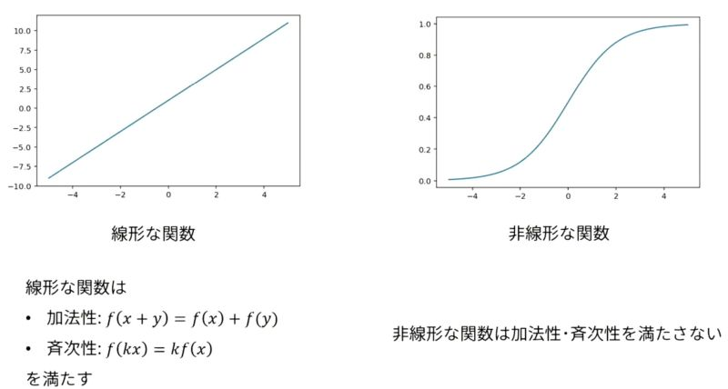

# 深層学習Day1 第二章 活性化関数 

- ニューラルネットワークにおいて、次の層への出力の大きさを決める非線形の関数
- 入力値の値によって、次の層への信号のON/OFFや強弱を定める働きをもつ

## 確認テスト1

- 線形と非線形の違いを図にかいて簡易に説明せよ

<br>



<br>

- 考察
    - 直線(一次関数)とそれ以外の曲線(二次間数など)、という区別では十分条件にはなりえないのか。


## 中間層用の活性化関数
- ReLU関数
- シグモイド関数
- ステップ関数

## 出力層用の活性化関数
- ソフトマックス関数
- 恒等写像
- シグモイド関数

## 確認テスト2

- 線形と非線形の違いを図にかいて簡易に説明せよ

```
z1 = functions.sigmoid(u)
```

- 考察
    - 前章でよくわからないデバッグをしたことで理解はすぐにできた。

---

# ハンズオン
- 1_2_back_propagation.ipynbを実行

- 結果

```
##### ネットワークの初期化 #####
*** 重み1 ***
[[0.1 0.3 0.5]
 [0.2 0.4 0.6]]

*** 重み2 ***
[[0.1 0.4]
 [0.2 0.5]
 [0.3 0.6]]

*** バイアス1 ***
[0.1 0.2 0.3]

*** バイアス2 ***
[0.1 0.2]

##### 順伝播開始 #####
*** 総入力1 ***
[[1.2 2.5 3.8]]

*** 中間層出力1 ***
[[1.2 2.5 3.8]]

*** 総入力2 ***
[[1.86 4.21]]

*** 出力1 ***
[[0.08706577 0.91293423]]

出力合計: 1.0

##### 誤差逆伝播開始 #####
*** 偏微分_dE/du2 ***
[[ 0.08706577 -0.08706577]]

*** 偏微分_dE/du2 ***
[[-0.02611973 -0.02611973 -0.02611973]]

*** 偏微分_重み1 ***
[[-0.02611973 -0.02611973 -0.02611973]
 [-0.13059866 -0.13059866 -0.13059866]]

*** 偏微分_重み2 ***
[[ 0.10447893 -0.10447893]
 [ 0.21766443 -0.21766443]
 [ 0.33084994 -0.33084994]]

*** 偏微分_バイアス1 ***
[-0.02611973 -0.02611973 -0.02611973]

*** 偏微分_バイアス2 ***
[ 0.08706577 -0.08706577]

##### 結果表示 #####
##### 更新後パラメータ #####
*** 重み1 ***
[[0.1002612  0.3002612  0.5002612 ]
 [0.20130599 0.40130599 0.60130599]]

*** 重み2 ***
[[0.09895521 0.40104479]
 [0.19782336 0.50217664]
 [0.2966915  0.6033085 ]]

*** バイアス1 ***
[0.1002612 0.2002612 0.3002612]

*** バイアス2 ***
[0.09912934 0.20087066]

```

- 考察
    - ここのコメント文では中間層という単語を使っている。コメント文の表記が揺れるのは注意願いたい。

---

# 気づき
- 講義を受けているときはよくわからなかったが、後のテストを通してようやく理解できた。今ではシグモイド関数を空でもグラフが描けるようになった。
