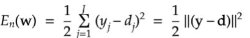
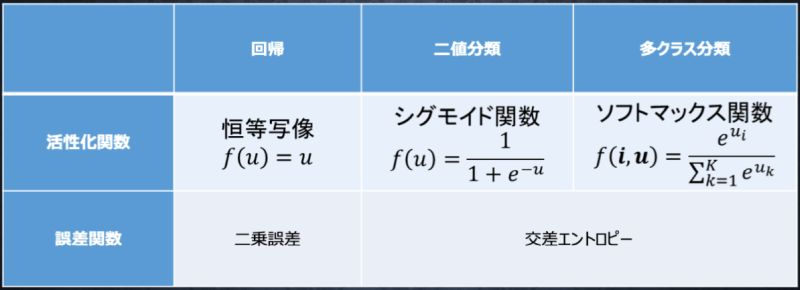
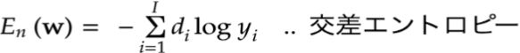

# 深層学習Day1 第三章 出力層

## 出力層の役割
- 確率を表示する

## ニューラルネットワークに事前に必要なデータ
- 入力データ
- 訓練データ（正解値）

## 誤差関数

<br>



<br>

## 確認テスト1

- ①なぜ、引き算でなく二乗するか述べよ
- ②下式の1/2はどういう意味を持つか述べよ

<br>


<br>

- ①二乗する理由
    - 引き算を行うだけでは、書くラベルでの誤差で正負両方の値が発生し、全体の誤差を正しく表すのに都合が悪い。二乗してそれぞれのラベルでの誤差を性の値になるようにする。
- ②1/2する理由
    - 実際にネットワークを学習するときに行う誤差逆伝播の計算で、誤差関数の微分を用いるが、その際の計算式を簡単にするため。本質的な意味はない。

- 考察
    - 動画では「誤差逆伝搬」と誤字がありました。誤字はここに限った話ではないですが、専門用語の誤字はなるべく控えていただきたい。


## 出力層の活性化関数
- 中間層用の活性化関数とは目的が異なる
    - 人間が使いやすい形に変換する
- 値の強弱を調整
    - 信号の大きさ（比率）はそのままに変換
- 分類問題の場合、出力層の出力は0～1の半にに限定し、総和を1とする必要がある

## 出力層用の活性化関数
- ソフトマックス関数
- 恒等写像
- シグモイド関数

<br>



<br>

## 確認テスト2

- 上図のソフトマックス関数に使用されている①左辺、②右辺の分子、③右辺の分母の数式に該当するソースコードを示し、1行ずつ処理の説明をせよ。

- ①関数を定義

```
def softmax(x):
```

- ②自然対数の底を要素数乗

```
np.exp(x)
```

- ③分子の数式を全要素分足し合わせる

```
np.sum(np.exp(x), axis=0)
```

- 考察
    - 誤字（☓ づつ 、◯ ずつ）
    - 結局、動画内でテストの答えには言及していない。周辺知識はいっぱい解説されてるが。

## 確認テスト3

<br>



<br>

- 上図のソフトマックス関数に使用されている①左辺、②右辺の数式に該当するソースコードを示し、1行ずつ処理の説明をせよ。

- ①関数を定義

```
defcross_entropy_error(d, y):
```

- ②（下記に記載）

```
    if y.ndim == 1:                     # yの次元が1の場合
        d = d.reshape(1, d.size)        # dを(1x?)行列に変換
        y = y.reshape(1, y.size)        # yを(1x?)行列に変換
        
    # 教師データがone-hot-vectorの場合、正解ラベルのインデックスに変換
    if d.size == y.size:                # dとyの配列サイズが同じ場合
        d = d.argmax(axis=1)            # d行列の要素の最大値をdに入力
             
    batch_size = y.shape[0]             # yの配列の大きさをbatch_sizeに入力
    return -np.sum(np.log(y[np.arange(batch_size), d] + 1e-7)) / batch_size # 画像の数式通りに代入。np.arange(batch_size)は等差数列を生成する
```

- 考察
    - まだまだ数式からプログラムを生成するのが苦手。他にも例をたくさん目にして勉強する必要がある。

---

# ハンズオン

- 該当するハンズオン用のデータはなし

---

# 気づき
- これまで中間層と出力層の活性化関数に関して意識したことがなかった。シグモイド関数ばかり問題に出てきたせいだろうか。とにかくそれぞれの目的を強く意識していこうと思った。
