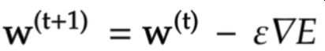
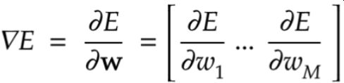
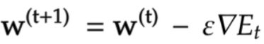
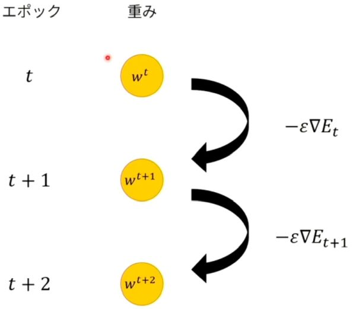

# 深層学習Day1 第四章 勾配降下法

- ～降下法には3種類ある
    - 勾配降下法
    - 確率的勾配降下法
    - ミニバッチ勾配降下法
- 前回学習した内容から次回の更新に活かす

- 深層学習の目的
    - 学習を通して誤差を最小にするネットワークを作成すること

## 勾配降下法

<br>



<br>



<br>

## 確認テスト1

- 上記数式の、該当するソースコードを探してみよう。

- （上）

```
network[key]  -= learning_rate* grad[key]
```

- （下）

```
grad = backward(x, d, z1, y)
```

- 考察
    - backwardは逆伝播を意味している。

## 確率的勾配降下法（SGD)

- ランダムに抽出したサンプルの誤差

- 確率的勾配降下法のメリット
    - データが冗⻑な場合の計算コストの軽減
    - 望まない局所極小解に収束するリスクの軽減
    - オンライン学習ができる

## 確認テスト2

- オンライン学習とは何か。2行でまとめよ。

- オンライン学習とは
    - 学習データが入ってくるたびに都度パラメータを更新し、学習を進めていく方法。一方、バッチ学習では一度にすべての学習データを使ってパラメータ更新を行う。

- 考察
    - これだけ聞くといいことづくめだが、実際はどうなんだろうか。

## ミニバッチ勾配降下法

- データを小分けにして勾配降下法を実行
- ランダムに分割したデータの集合（ミニバッチ）Dtに属するサンプルの平均誤差

<br>



<br>

## 確認テスト3

- 上記数式の意味を図に書いて説明せよ

- エポックごとに重みパラメータが更新されていく

<br>



<br>


- 考察
    - どれだけの小分けをするか、何を基準に分けるのかが難しそう。
---

# ハンズオン

- 1_3_stochastic_gradient_descent.ipynbを実行
- 結果

<br>


<br>

---

# 気づき
- どんな業者もウルトラハイスペックマシンを使ってるわけはないだろうから、そうなると確率的勾配降下法を採用していることが多い気がした。
