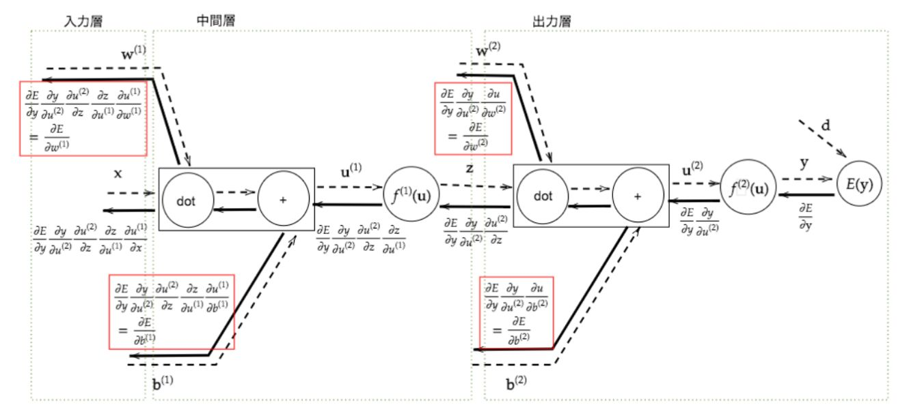

# 深層学習Day1 第五章 誤差逆伝播法

## 誤差勾配はどう計算する？

<br>


<br>

- 数値微分
    - プログラムで微小な数値を生成し擬似的に微分を計算する一般的な手法

- 数値微分のデメリット
    - 各パラメータWmそれぞれについて、E(Wm + h) やE(Wm - h)を計算するために、順伝播の計算を繰り返し行う必要があり負荷が大きい

## → 誤差逆伝播を利用する

<br>


<br>

- より複雑なパターン

<br>



<br>

## 確認テスト1

- 誤差逆伝播法では不要な再帰的処理を避ける事が出来る。既に行った計算結果を保持しているソースコードを抽出せよ。

```
    delta2 = functions.d_softmax_with_loss(d, y)
```

- 考察
    - 動画で示した部分とファイルのソースコードが違う。本当にやめてほしい。

## 誤差逆伝播法の勘所
- 微分の連鎖律を利用する

<br>


<br>

## 確認テスト2

<br>


<br>


<br>

- 上記数式の、該当するソースコードを探せ。

- （上）

```
delta2 = functions.d_mean_squared_error(d, y)
```

- （下）

```
grad['W2'] = np.dot(z1.T, delta2)
```

- 考察
    - np.dot関数で勾配を表現できているのがとても理解が難しい。

---

# ハンズオン

- 1_4_1_mnist_sample.ipynbを実行

## 結果

<br>


<br>

- 考察
    - 

---

# 気づき
- 今までの数式の中で一番動作が複雑で、なかなか理解に苦しむ内容だった。じっくり時間をかけて理解をしていきたい。

