# 深層学習Day2 第一章 勾配消失問題 

- 学習がうまくいかなくなる問題の一種
- 左図では正解率が上がっていかない

 

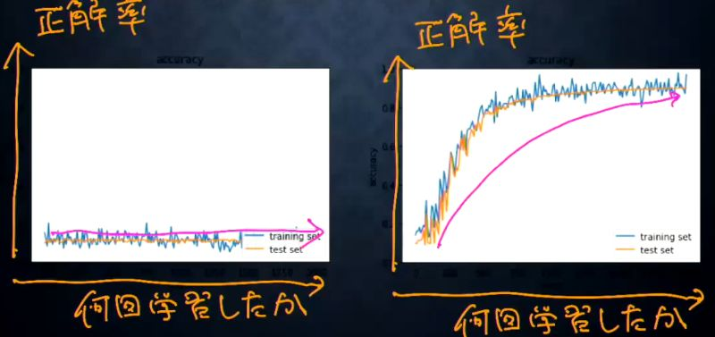

 

## 勾配消失問題の復習
- 研鑽結果（＝誤差）から微分を逆算することで不要な再帰的計算を避けて微分を算出できる

 

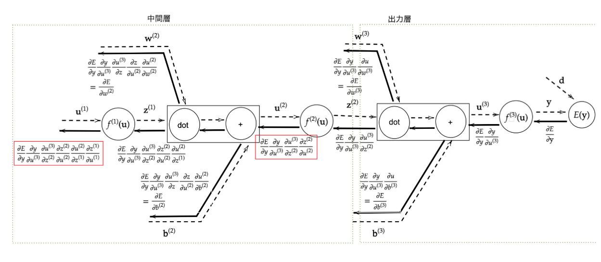

 

## 確認テスト1

- シグモイド関数を微分した時、入力値が0の時に最大値をとる。その値として正しいものを選択肢から選べ

- 0.25

- 考察
    - これは暗算でできた。シグモイド関数の微分形を暗記していればそのまま入力して終了となる。

## 勾配消失問題のビジョン

- シグモイド関数をかけるたびに0に近づいてしまう

## 勾配消失の解決方

- 活性化関数の選択
- 重みの初期値設定
- バッチ正規化

## 活性化関数による解決

- ReLU関数
    - 0以上のとき、そのまま使われる。0より小さい場合、0になる
        - 必要な値のみ使われる（スパース化）

## 重みの初期値設定による解決
- Xavierの初期値を設定する際の活性化関数
    - ReLU関数uシグモイド（ロジスティック）関数
    - 双曲線正接関数

## 確認テスト2

- 重みの初期値に0を設定すると、どのような問題が発生するか。簡潔に説明せよ。

- 正しい学習が行えない
    - すべての重みの値が均一に更新されるため、多数の重みを持つ意味がなくなるから

- 考察
    - このデメリットだけを鑑みると、全く使いたいと思わない。あまり重み設定に重点を置かないモデルに有効なのだろうか。

## バッチ正規化による解決

- ミニバッチ単位で、入力値のデータの偏りを抑制する手法
- バッチ正規化の使い所とは︖
    - 活性化関数に値を渡す前後に、バッチ正規化の処理を孕んだ層を加える

 

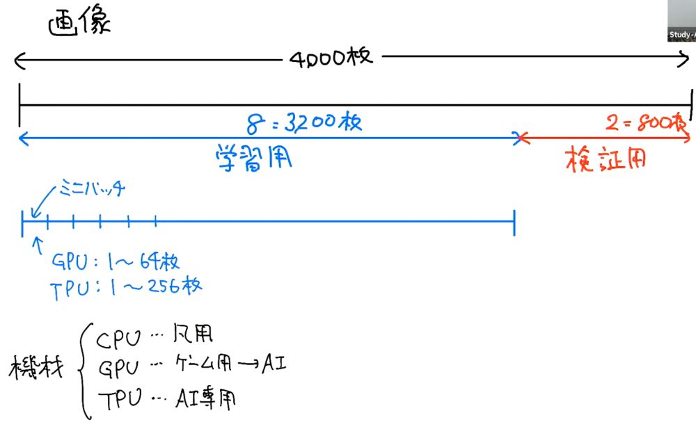

 

## 確認テスト3

- 一般的に考えられるバッチ正規化の効果を2点挙げよ。

- 過学習が抑えられる
- 中間層の重みの更新が安定化する

- 考察
    - 文字で書かれた問題に対しては文字で答えてほしいのだが。

## 例題チャレンジ

- （問題文が長いので回答のみ）

- (1) data_x[i:i_end], data_t[i:i_end]

- 考察
    - なぜ、回答を表示した際、数字を取り除いたのでしょうか。理解に苦しみます。

---

# ハンズオン

- 2_1_network_modified.ipynbを実行（正解率が順当に上昇）

 

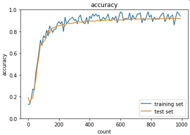

 

- 2_2_1_vanishing_gradient.ipynbを実行（正解率が伸びない）

 

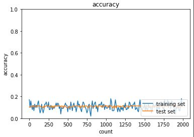

 

- ReLU関数による対策

 

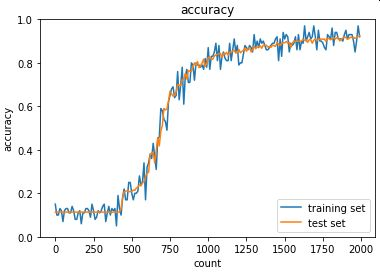

 

- Xavierによる対策

 

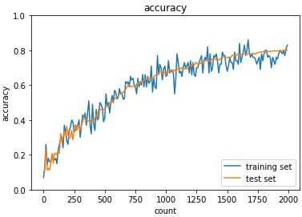

 

- ReLU関数 - Heによる対策

 

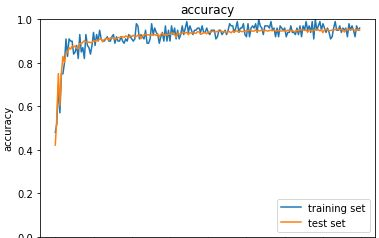

 

- シグモイド関数 - ガウスによる対策

 

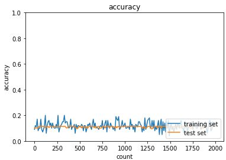

 

- ReLU関数 - ガウスによる対策

 

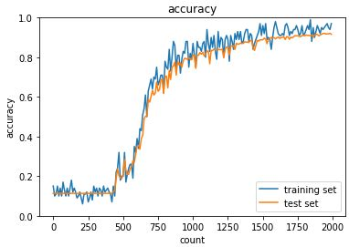

 

- シグモイド関数 - Xavierによる対策

 

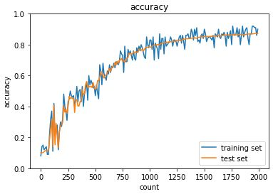

 

- ReLU関数 - Heによる対策

 

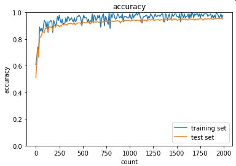

 

- 考察
    - 各対策ごとに向き・不向きがあるのと、傾向が似ることが理解できた。

---

# 気づき
- これだけ多くのパターンがあるということは、それぞれの手法がそれほど汎用的でないということなのだろう。それくらい、勾配消失問題というのは頻繁に起きる重大な問題なのだと思われた。

