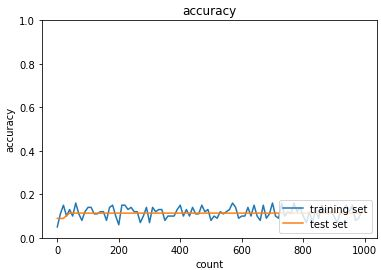
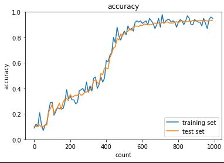
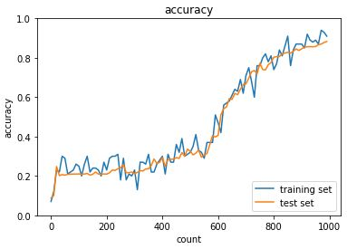
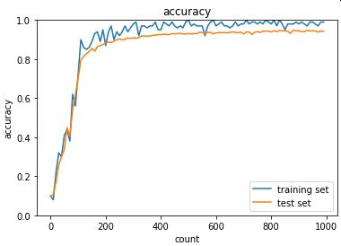
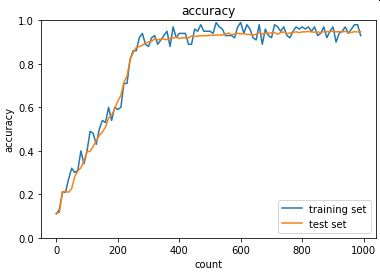

# 深層学習Day2 第二章 学習最適化手法

## 学習率

- 学習率の値が大きい場合
    - 最適値にいつまでもたどり着かず発散してしまう
- 学習率の値が小さい場合
    - 発散することはないが、小さすぎると収束するまでに時間がかかってしまう。
    - 大域局所最適値に収束しづらくなる

## 学習率の決め方とは

- 初期の学習率設定方法の指針
    - 初期の学習率を大きく設定し、徐々に学習率を小さくしていく
    - パラメータ毎に学習率を可変させる

## →学習率最適化手法を利用して学習率を最適化

## 学習率最適化手法
- モメンタム
- AdaGrad
- RMSProp
- Adam

## モメンタム
- 誤差をパラメータで微分したものと学習率の積を減算した後、現在の重みに前回の重みを減算した値と慣性の積を加算する

- メリット
    - 局所的最適解にはならず、大域的最適解となる。
    - 谷間についてから最も低い位置(最適値)にいくまでの時間が早い

## AdaGrad
- 誤差をパラメータで微分したものと再定義した学習率の積を減算する

- メリット
    - 勾配の緩やかな斜面に対して、最適値に近づける
- 課題
    - 学習率が徐々に小さくなるので、鞍点問題を引き起こす事があった

※鞍点（あんてん、saddle point）は、多変数実関数の変域の中で、ある方向で見れば極大値だが別の方向で見れば極小値となる点である

## RMSProp
- 誤差をパラメータで微分したものと再定義した学習率の積を減算する

- メリット
    - 局所的最適解にはならず、大域的最適解となる。
    - ハイパーパラメータの調整が必要な場合が少ない

## Adam
- モメンタムの、過去の勾配の指数関数的減衰平均
- RMSPropの、過去の勾配の2乗の指数関数的減衰平均
- 上記をそれぞれ孕んだ最適化アルゴリズムである

- メリット
    - モメンタムおよびRMSPropのメリットを孕んだアルゴリズムである。

## 確認テスト1

- モメンタム・AdaGrad・RMSPropの特徴をそれぞれ簡潔に説明せよ。

- モメンタム・・・谷間についてから最も低い位置(最適値)にいくまでの時間が早い
- AdaGrad・・・勾配の緩やかな斜面に対して、最適値に近づける
- RMSProp・・・局所的最適解にはならず、大域的最適解となる
- Adam・・・モメンタムとRMSPropの特徴を併せ持っている

- 考察
    - 講義中のグラフ動画がとても参考になった。あの動きはそれぞれ覚えておく必要があるだろう。

---

# ハンズオン
- 2_4_optimizer_after.ipynbを実行

- 結果

- SGD

 

 

- Momentum

 

 

- Adagrad

 

 

- RMSProp

 

 

- Adam

 

 

- 考察
    - この結果だけを観るとRMSPropとAdamがただ素晴らしいとなるが、計算コストはどうなのだろう。他にも手法選択の際に考慮すべき事項はあると思われた。

---

# 気づき
- これらの手法を開発する手法はどういったものだろうか。おそらくこれからもあらたな最適化手法は開発されていくと思うが、そういった専門の職種があるのかと疑問に思った。
