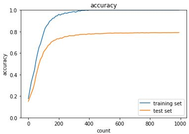

# 深層学習Day2 第三章 過学習

## 過学習とは

- テスト誤差と訓練誤差とで学習曲線が乖離すること
- 特定の訓練サンプルに対して、特化して学習する

- 原因
    - パラメータの数が多い
    - パラメータの値が適切でない
    - ノードが多い
    - ネットワークの自由度(層数、ノード数、パラメータの値etc...)が高い

## 正則化とは
- ネットワークの自由度(層数、ノード数、パラメータの値etc...)を制約すること

## 正則化手法
- L1正則化、L2正則化
- ドロップアウト

## 確認テスト1

- リッジ回帰の特徴として正しいものを選択しなさい。

- (a)ハイパーパラメータを大きな値に設定すると、すべての重みが限りなく0に近づく

- 考察
    - 現状は「ただそうなる、としか理解できていない。試験本番前までに理解しておきたい

## Weight decay(荷重減衰)

- 過学習の原因
    - 重みが大きい値をとることで、過学習が発生することがある。
- 過学習の解決策
    - 誤差に対して、正則化項を加算することで、重みを抑制する学習させていくと、重みにばらつきが発生する。
    - 重みが大きい値は、学習において重要な値であり、重みが大きいと過学習が起こる過学習がおこりそうな重みの大きさ以下で重みをコントロールし、かつ重みの大きさにばらつきを出す必要がある。

## L1,L2正則化
- p=1の場合、L1正則化と呼ぶ
- p=2の場合、L2正則化と呼ぶ

 

 

 

## 確認テスト2

- 下図について、L1正則化を表しているグラフはどちらか答えよ

- Laaso推定量の方

- 考察
    - L1の場合、グラフが線形になり、L2の場合、グラフが曲線になる、と暗記している

## 例題チャレンジ1

- L2パラメータ正則化

- (4) param

- L2ノルムは、||param||^2なのでその勾配が誤差の勾配に加えられる。つまり、2 * paramであるが、係数2は正則化の係数に吸収されても変わらないのでparamが正解である。

## 例題チャレンジ2

- L1パラメータ正則化

- (3) np.sign(param)

- L1ノルムは、|param|なのでその勾配が誤差の勾配に加えられる。つまり、sign(param)である。signは符号関数である。

## 例題チャレンジ3

- データ集合の拡張

- (4) image[top:bottom, left:right, :]

- Limageの形式が(縦幅, 横幅, チャンネル)であるのも考慮する

## ドロップアウト

- 過学習の課題
    - ノードの数が多い
- ドロップアウトとは︖
    - ランダムにノードを削除して学習させること

- メリット
    - データ量を変化させずに、異なるモデルを学習させていると解釈できる

---

# ハンズオン
- 2_5_overfiting.ipynbを実行

- 結果

- overfitting

 

 

- weight decay

 

 

- L1

 

 

- dropout

 

 

- Dropout + L1

 

 

- 考察
    - 唯一まともな結果に見えるのがドロップアウト手法だろうか。ドロップアウトとL1正則化も悪くはないが、ドロップアウトのみの手法のほうがましな結果に思える。
    - とはいえ、どれも完全に過学習を抑制できるものではないことを理解できた。

---

# 気づき
- 色々と手法はあるものの完全には解決に至らないという点で、過学習というのはなかなか大変な状況であることが理解できた。
