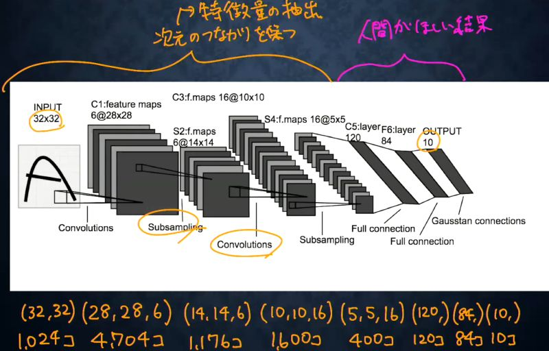
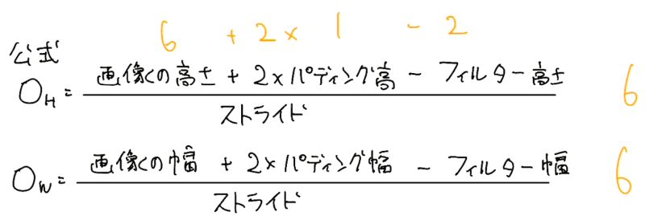
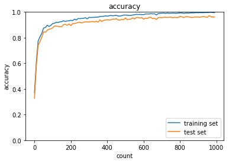

# 深層学習Day2 第四章 畳み込みニューラルネットワークの概念

- 画像や音声の学習モデルとしてよく利用される
- 中間層に以下の層が存在するのが特徴
    - 畳み込み層
    - プーリング層
    - 全結合層

## 畳み込み層
- 畳み込み層では、画像の場合、縦、横、チャンネルの3次元のデータをそのまま学習し、次に伝えることができる
- 3次元の空間情報も学習できるような層が畳み込み層である
- 以下の演算方法が存在する
    - バイアス
    - パディング
    - ストライド
    - チャンネル

## LeNetの構造図

<br>



<br>

## プーリング層
- 対象領域のMax値または平均値を取得

## 確認テスト1

- サイズ6×6の入力画像を、サイズ2×2のフィルタで畳み込んだ時の出力画像のサイズを答えよ。なおストライドとパディングは1とする。

<br>



<br>

- 上画像の公式からさらに両方とも+1して、7x7

- 考察
    - 公式があるのでさっさと覚えてしまったほうが良さそう。

---

# ハンズオン

- 2_6_simple_convolution_network_after.ipynbを実行
- 結果

- col2imの処理


```
========== input_data ===========
 [[[[87. 14. 81. 29.]
   [45. 29.  3. 34.]
   [87. 56. 62. 18.]
   [96. 55. 86. 51.]]]


 [[[13. 71. 57. 39.]
   [30. 74. 98. 46.]
   [28. 60.  4. 73.]
   [82. 91. 20. 24.]]]]
==============================
============= col ==============
 [[87. 14. 81. 45. 29.  3. 87. 56. 62.]
 [14. 81. 29. 29.  3. 34. 56. 62. 18.]
 [45. 29.  3. 87. 56. 62. 96. 55. 86.]
 [29.  3. 34. 56. 62. 18. 55. 86. 51.]
 [13. 71. 57. 30. 74. 98. 28. 60.  4.]
 [71. 57. 39. 74. 98. 46. 60.  4. 73.]
 [30. 74. 98. 28. 60.  4. 82. 91. 20.]
 [74. 98. 46. 60.  4. 73. 91. 20. 24.]]
==============================
```

<br>

- col2imの処理

```
[[[[ 87.  28. 162.  29.]
   [ 90. 116.  12.  68.]
   [174. 224. 248.  36.]
   [ 96. 110. 172.  51.]]]


 [[[ 13. 142. 114.  39.]
   [ 60. 296. 392.  92.]
   [ 56. 240.  16. 146.]
   [ 82. 182.  40.  24.]]]]
```

<br>

- sinple convolution network class

<br>



<br>

---

# 気づき
- 最後の、sinple convolution network classの処理が重すぎてなかなか終わらなかった。CNNってもしかしてかなり重い処理なのだろうか。軽量化について検討する必要があると思われる。
