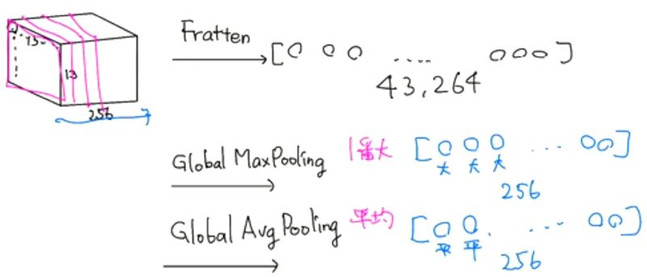
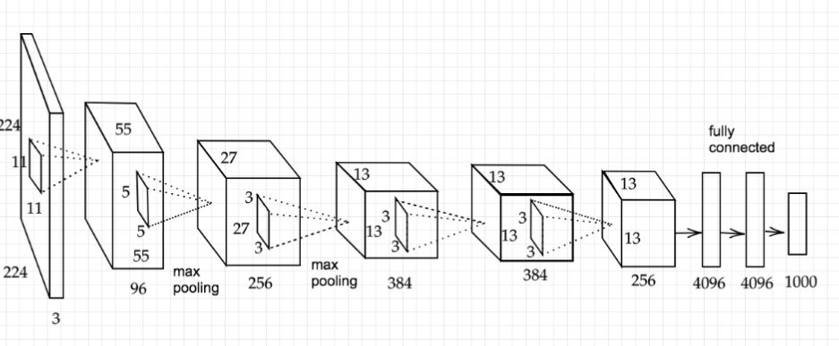

# 深層学習Day2 第五章 最新のCNN

## 畳み込み演算メモ

 

 

## AlexNet

- 物体認識のために、初めて深層学習の概念および畳み込みニューラルネットワークの概念を取り入れた、世界で初めてのアーキテクチャ
- 2012年の画像分類チャレンジコンテスト（ILSVRC）において、AlexNet が飛躍てきな性能を果たした
- 過学習を防ぐ施策
    - サイズ4096の全結合層の出力にドロップアウトを使用している

 

 

- 入力画像は 224 × 224 サイズの正方形
- 出力は 1,000 個の要素を持つ 1 次元のベクトル
- 1 枚の正方形の画像を上下半分に分けて、上半分と下半分をそれぞれ 2 つの GPU で学習を進めて、最後の全結合層で結合させている。

---

# 気づき
- 今のディープラーニング全盛期のきっかけともなったAlexNet。もともとは2006年のディープラーニング研究発表であったがそれから6年の時を経て、ようやく日の目をみることができたというのが感慨深い。

# 外部リンク
[AlexNet解説](https://axa.biopapyrus.jp/deep-learning/cnn/image-classification/alexnet.html)

[AlexNet論文](https://papers.nips.cc/paper/2012/file/c399862d3b9d6b76c8436e924a68c45b-Paper.pdf)
