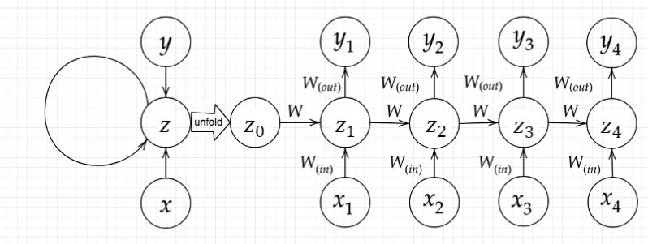
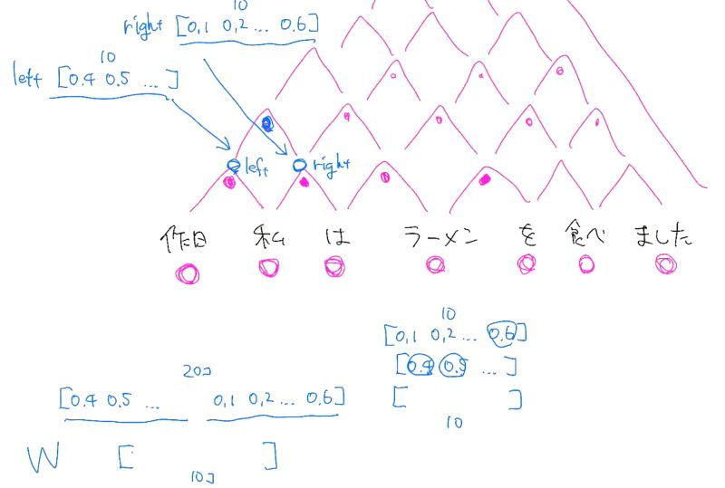
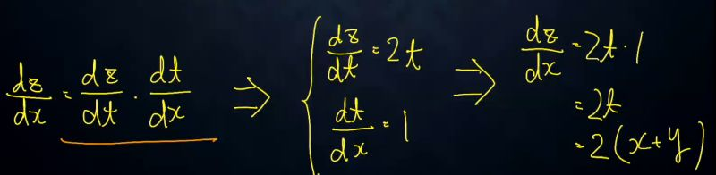
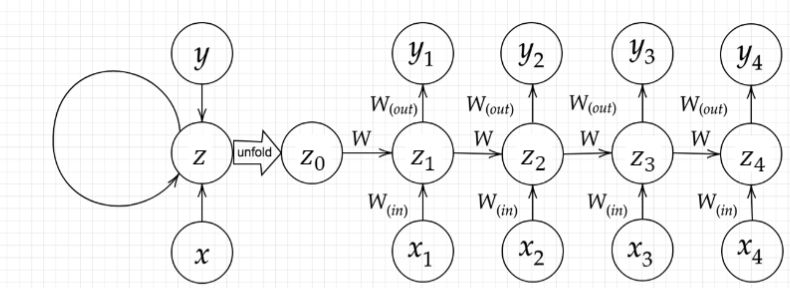
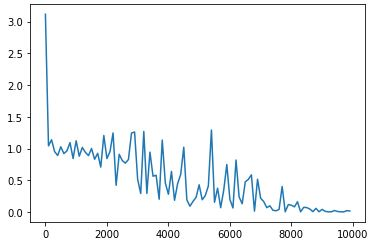

# 深層学習Day3 第一章 再帰型ニューラルネットワークの概念

## 確認テスト1
- サイズ5×5の入力画像を、サイズ3×3のフィルタで畳み込んだ時の出力画像のサイズを答えよ。なおストライドは2、パディングは1とする

- 3x3

- 考察
    - パディングがあることを忘れていた。注意しよう。

## RNNとは

- 時系列データに対応可能な、ニューラルネットワークである

## 時系列データとは
- 時間的順序を追って一定間隔ごとに観察され，しかも相互に統計的依存関係が認められるようなデータの系列
- 具体例
    - 音声データ
    - テキストデータ
## RNNの全体像

 

 

## 確認テスト2
- RNNのネットワークには大きくわけて3つの重みがある。1つは入力から現在の中間層を定義する際にかけられる重みWin、1つは中間層から出力を定義する際にかけられる重みWoutである。残り1つの重みについて説明せよ
- 中間層から次の中間層を定義する際にかけられる重み
    - 上図の、Z0→Z1にかけられるWのこと
- 考察
    - 中間層から中間層への重みはすべて同じ重みを使用するのですね。

## RNNの特徴
- 時系列モデルを扱うには、初期の状態と過去の時間t-1の状態を保持し、そこから次の時間でのtを再帰的に求める再帰構造が必要になる

## 演習チャレンジ

- 構文木メモ

 

 

- （問題文は省略）

- （2）W.dot(np.concatenate([left, right]))

- 隣接単語（表現ベクトル）から表現ベクトルを作るという処理は、隣接している表現leftとrightを合わせたものを特徴量としてそこに重みを掛けることで実現する。つまり、W.dot(np.concatenate([left, right]))である。

- 考察
    - 「なんらかの活性化関数」といった、具体例ではなく概念だけ与えられる問題が苦手だ。なぜならその概念に対して深く理解しておく必要があるからだ。

## BPTT
- RNNにおいてのパラメータ調整方法の一種
- 誤差逆伝播の一種

## 確認テスト3
- 連鎖律の原理を使い、dz/dxを求めよ

 

 

## 確認テスト4
- 下図のy1をx・s0・s1・win・w・woutを用いて数式で表せ。※バイアスは任意の文字で定義せよ。
- ※また中間層の出力にシグモイド関数g(x)を作用させよ

 

 

- S1 = x1・Win + S0・W + b
- y1 = g(Wout・S1)
- よって
- y1 = g(Wout・S1 + c)
- S1 = f(Win・x1 + W・S0 + b)

- 考察
    - 何をやっているか全然わからなかった。復習が必要だ。

## コード演習問題

- （問題文は省略）

- （2）delta_t.dot(U)

- 考察
    - dot関数ってどこでも登場してくる。一度dot関数について深く勉強しておく必要があるように思われる。

---

# ハンズオン

- 3_1_simple_RNN_after.ipynbを実行

- simple RNN after

## 結果
- 「回帰（2-3-2ネットワーク）」部分の出力結果を表示

 

 

- 考察
    - デバッグが大変でした。
    - あとで1_1_forward_propagation.ipynbを実行したら問題なくfrom common import functionsが実行できた。おそらくだが、マウントしたタイミングが悪かったように思われる。

---

# 気づき
- CNNと字面は似ているのに、概念の難しさはCNNと比較してかなり難しい。理解するのにも時間がかかりそうだ。

