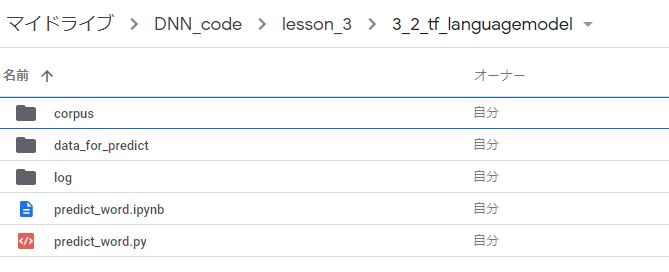

# 深層学習Day3 第二章 LSTM 

## RNNの課題
- RNNでは勾配消失問題が非常に起こりやすい
- 時系列を遡れば遡るほど、勾配が消失していく。
    - 長い時系列の学習が困難
- 解決策
    - 勾配消失の解決方法とは別で、構造自体を変えて解決したものがLSTM。

## 確認テスト1

- シグモイド関数を微分した時、入力値が0の時に最大値をとる。その値として正しいものを選択肢から選べ
- (2) 0.25

- 考察
    - もはや微分式も含めて答えを覚えていた


## 勾配爆発
- 勾配が層を逆伝播するごとに指数関数的に大きくなっていく

## 演習チャレンジ1
- （問題文は省略）
- （1）gradient * rate
- 勾配のノルムがしきい値より大きいときは、勾配のノルムをしきい値に正規化するので、クリッピングした勾配は、勾配×(しきい値/勾配のノルム)と計算される。つまり、gradient * rateである。
- 考察
    - ノルムという単語にまだ慣れない。ずっと絶対値とか大きさで理解していた概念に当たるが、一度歴史について調べてみよう。

## LSTM
### CEC
- 勾配消失および勾配爆発の解決方法として、勾配が1であれば解決できる
- CECの課題
    - 入力データについて、時間依存度に関係なく重みが一律である
        - ニューラルネットワークの学習特性が無い

### 入力・出力ゲート
- 入力・出力ゲートを追加することで、それぞれのゲートへの入力値の重みを、重み行列W,Uで可変可能とする
    - CECの課題を解決

## LSTMブロックの課題
- LSTMの現状
    - CECは、過去の情報が全て保管されている
- 課題
    - 過去の情報が要らなくなった場合、削除することはできず、保管され続ける

- 解決策
    - 過去の情報が要らなくなった場合、そのタイミングで情報を忘却する機能が必要
        - 忘却ゲートの誕生


## 確認テスト2
- 以下の文章をLSTMに入力し空欄に当てはまる単語を予測したいとする。文中の「とても」という言葉は空欄の予測においてなくなっても影響を及ぼさないと考えられる。このような場合、どのゲートが作用すると考えられるか。
    - 「映画おもしろかったね。ところで、とてもお腹が空いたから何か____。」

- 忘却ゲート
- 考察
    - 他にも例題がほしい。いまいちわからなかった。

## 演習チャレンジ2
- （問題文は省略）
- （3）input_gate* a + forget_gate* c
- 新しいセルの状態は、計算されたセルへの入力と1ステップ前のセルの状態に入力ゲート、忘却ゲートを掛けて足し合わせたものと表現される。つまり、input_gate* a + forget_gate* cである。
- 考察
    - この前のページの図を見ればわかるが、構造を覚えておく必要がある。


## 覗き穴結合
- CEC自身の値に、重み行列を介して伝播可能にした構造
- 課題
    - CECの保存されている過去の情報を、任意のタイミングで他のノードに伝播させたり、あるいは任意のタイミングで忘却させたい。CEC自身の値は、ゲート制御に影響を与えていない


---

# ハンズオン
- 3_3_predict_sin.ipynbを実行

- 結果

- 以下のエラーによりハンズオン中止した

```
---------------------------------------------------------------------------

FileNotFoundError                         Traceback (most recent call last)
<ipython-input-6-9c46e3db5ed6> in <module>()
      1 import os
----> 2 os.chdir('drive/My Drive/DNN_code/lesson_3/3_2_tf_languagemodel/')

FileNotFoundError: [Errno 2] No such file or directory: 'drive/My Drive/DNN_code/lesson_3/3_2_tf_languagemodel/'

---------------------------------------------------------------------------

AttributeError                            Traceback (most recent call last)
<ipython-input-4-3df99e34256c> in <module>()
     11 
     12 # logging levelを変更
---> 13 tf.logging.set_verbosity(tf.logging.ERROR)
     14 
     15 class Corpus:

AttributeError: module 'tensorflow' has no attribute 'logging'
---------------------------------------------------------------------------
```

- フォルダにはマウントする以前からファイルを配置済み

<br>



<br>

- 考察
    - どうやら他のデータとは別のフォルダ構造をもつファイルを参照しようとすると頻繁にエラーになる様子。あまりフォルダを変更せずにファイルの配置をお願いしたい。

---

# 気づき
- ここのハンズオンに限らないが、マウントにともなう新規ファイルの読み込みエラーが頻繁に発生する。おそらく私よりも講師の方々の方にとっても既知の問題かと思われるので、生徒にはそういったエラーを回避するような工夫を設けてほしい。

