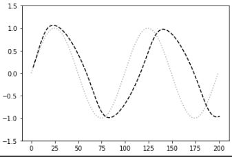
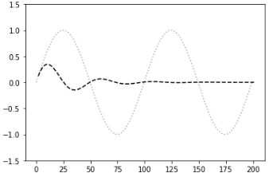
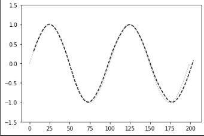

# 深層学習Day1 第三章 出力層

## GRU
- 従来のLSTMでは、パラメータが多数存在していたため、計算負荷が大きかった。しかし、GRUでは、そのパラメータを大幅に削減し、精度は同等またはそれ以上が望める様になった構造

- メリット
    - 計算負荷が低い

## 演習チャレンジ1
- （問題文は省略）
- （4）(1-z) * h + z * h_bar
- 新しい中間状態は、1ステップ前の中間表現と計算された中間表現の線形和で表現される。つまり更新ゲートzを用いて、(1-z) * h + z * h_barと書ける。
- 考察
    - GRUについての解説がテキストの方にほとんどなくて理解ができなかった。他のサイトなどを通じて勉強が必要である。

## 確認テスト1
- LSTMとCECが抱える課題について、それぞれ簡潔に述べよ
- LSTM
    - パラメータ数が多くなり、計算量が非常に多くなる
- CEC
    - 学習能力がない
- 考察
    - 上記の特徴よりはそのバックグラウンドの理解が重要と思われた

---

# ハンズオン

- 3_3_predict_sin.ipynbを実行

 

 

- iters_numを100にしよう

 

 

- maxlenを5, iters_numを3000にしよう

 

 

- 考察
    - maxlenを3→5、iters_numを500→3000にした場合、非常に処理時間が長くなったがかなりの高精度の結果が得られた

---

# 気づき
- テキストにGRUについての解説がほぼないので、自学自習する必要がある。一度、数式を除いた概念部分の理解から始める必要があると思い、以下のサイトで勉強すると少しはわかったような気がした。
 
[〈機械学習基礎〉数式なし！ LSTM・GRU超入門](https://agirobots.com/lstmgruentrance-noformula/)
