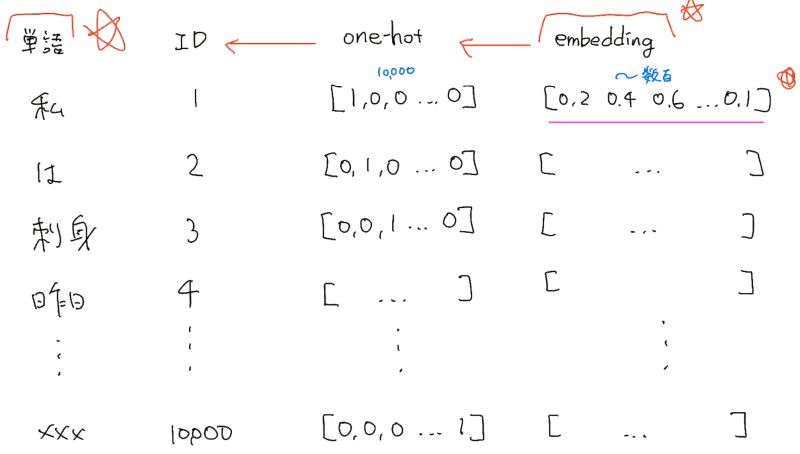

# 深層学習Day3 第六章 word2vec

- RNNでは、単語のような可変長の文字列をNNに与えることはできない。
    - 固定長形式で単語を表す必要がある

## word2vec
- 自然言語処理が前提
- 単語の分散表現
    - 単語を固定長のベクトルで表現すること
- 分布仮説
    - 単語の意味は周囲の単語によって形成される
- カウントベースと推論ベース
    - カウントベース・・・カウントベースの手法は周囲の単語の頻度によって単語を表現する方法
    - 推論ベース・・・ニューラルネットワークを用いて少量の学習サンプルをみながら重みを繰り返し更新する手法
    - word2vecは推論ベースに該当

- メリット
    - 大規模データの分散表現の学習が、現実的な計算速度とメモリ量で実現可能にした

## one-hotベクトルに変換メモ

 

 

---

# ハンズオン

- 該当するハンズオンはなし

---

# 気づき
- 内容が難解すぎてすぐには理解できない。以下のサイトの説明がとても詳しいので、時間を書けて学習してみようと思う。 
[Word2Vecを理解する](https://qiita.com/g-k/items/69afa87c73654af49d36)
 
[絵で理解するWord2vecの仕組み](https://qiita.com/Hironsan/items/11b388575a058dc8a46a)

