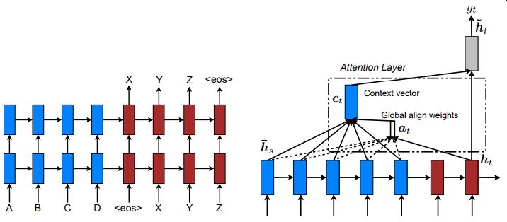
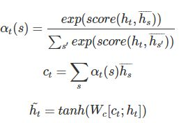

# 深層学習Day3 第七章 Attention Mechanism

- seq2seqでは長い文章への対応が難しかった
- 3単語のとても短い文であっても、50単語あるとても長い文であっても、その意味をある固定次元ベクトルの中に押し込む必要があった

## Attention Mechanism
- 「入力と出力のどの単語が関連しているのか」の関連度を学習させることで対応

 

 

- Attentionメカニズムでは時刻tにおけるDecoderの隠れ層のベクトルhtとEncoderの各時刻の隠れ層のベクトルhsのスコアを計算し時刻tでどの入力単語に注視するかのスコアαtを決定します。
- このスコアをもとにEncoderの隠れ層のベクトルの加重平均ctを求めそれをもとに時刻tの隠れ層のベクトルhtを計算します。

 

 

## 確認テスト1
- RNNとword2vec、seq2seqとAttentionの違いを簡潔に述べよ
- RNNは分散表現を取得するために使用すると、計算コストが大きくなる。
- word2vecはRNNの分散表現取得の課題を解決するのに特化したモデル。
- seq2seqは入力系列の情報をEncoderで圧縮したベクトルとしてしかDecoderに伝えることができない
- AttentionはDecode時に入力系列の情報を直接参照できる
- 考察
    - 講義で扱っていなかったため、以下のサイトを参考に調べました。
    [Attentionを理解するためにRNN、Word2Vec、LSTM、Seq2Seq、Attentionの順に整理してみた](https://qiita.com/ta2bonn/items/c645ecbcf9dabd0c4778)
    [Seq2Seq+Attentionのその先へ](https://qiita.com/ymym3412/items/c84e6254de89c9952c55)

---

# ハンズオン

- 該当するハンズオンはなし

---

# 気づき
- これまでの自然言語処理の技術はすべてディープラーニングに関するものなので、年月としてはそれほど経ってないにもかかわらず、技術革新がものすごいと感じた。 
- 色々な方たちが情報サイトを作成していただいているので全部見ておきたい。

