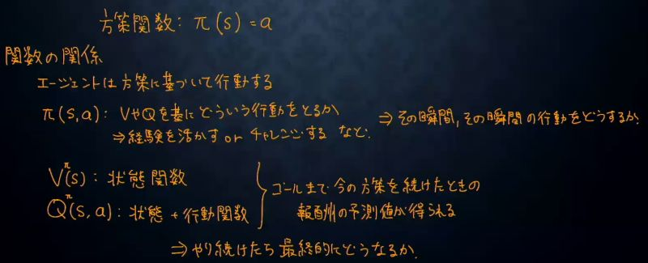

# 深層学習Day4 第一章 強化学習

- 長期的に報酬を最大化できるように環境のなかで行動を選択できるエージェントを作ることを目標とする機械学習の一分野
    - 行動の結果として与えられる利益(報酬)をもとに、行動を決定する原理を改善していく仕組み

## 強化学習の応用例
- マーケティング
- 囲碁・将棋・チェスなど

## 探索と利用のトレードオフ
- 「過去の経験から一番いいと思う行動」ばかりを していたのでは、もっとよい行動を見つけること ができない。(探索が足りない)
- もっといいものがあるかも！と「未経験の行動」 ばかりをしていたのでは、過去の経験が生かせな い。(利用が足りない) 

## 強化学習と通常の教師あり、教師なし学習との違い
- 目標が違う
    - 教師なし、あり学習では、データに含まれるパターンを見つけ出すおよびそのデータから予測することが目標
    - 強化学習では、優れた方策を見つけることが目標

## 強化学習は以下の手順を繰り返し行う
1. エージェントが環境に対して行動を起こす。
1. 環境がエージェントに更新された状態と報酬を与える。
1. エージェントは報酬をもとに行動の方策を修正し、1に戻る。

## 用語集

|  用語  |  意味  |
| ---- | ---- |
|  エージェント(Agent)  |  環境に対して行動を起こす学習者のような立場。強化学習ではこのエージェントが環境に対して様々な試行を繰り返し、状態ごとに行動を最適化していく。  |
|  環境(Environment)  |  エージェントの行動に対して状態の更新と報酬の付与を行う、観測者のような立場。  |
|  行動(Action)  |  エージェントがある状態sにおいて取ることができる行動。  |
|  状態(State)  |  環境が保持する環境の様子。エージェントが起こす行動に応じて更新される。  |
|  報酬(Reward)  |  エージェントの行動に対する環境からの報酬。この報酬はエージェントが環境に対して望ましい結果を作用させた時に与えられる。  |
|  方策(Policy)  |  エージェントが行動する際の指標となるルール。後記するQ学習では、行動価値関数において最も価値の高い行動が選択される。  |
|  行動価値関数(Value Function)  |  ある状態での行動の評価値を定める関数。状態数が少ない時にはテーブル(表)で表記できる。主な手法に、Q学習におけるQ関数などがある。  |

## Q学習
- 強化学習の手法の一つ
- 行動価値関数を、行動する毎に更新することにより学習を進める方法

## 方策関数メモ

 

 

---

# ハンズオン

- 該当するハンズオンはなし

---

# 気づき
- 具体的に何かを試したわけではなく、またこれまでの機械学習やディープラーニングとは目的が異なる考え方なので、なかなか受け入れがたい。日常生活ではおそらく一番身近なAIに実装されてるとは思うのだが、いざ勉強するとなると難しい。
- [【機械学習入門】 深層強化学習の基礎](https://avinton.com/blog/2017/10/basic-deep-reinforcement-learning/)
