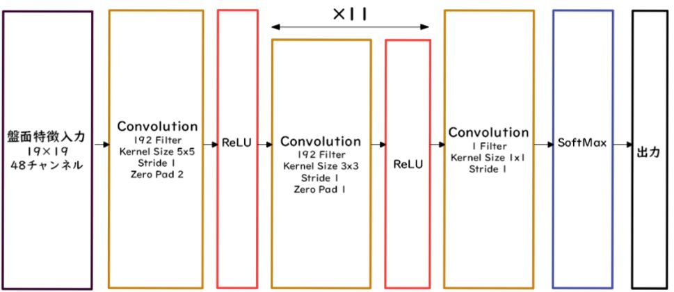
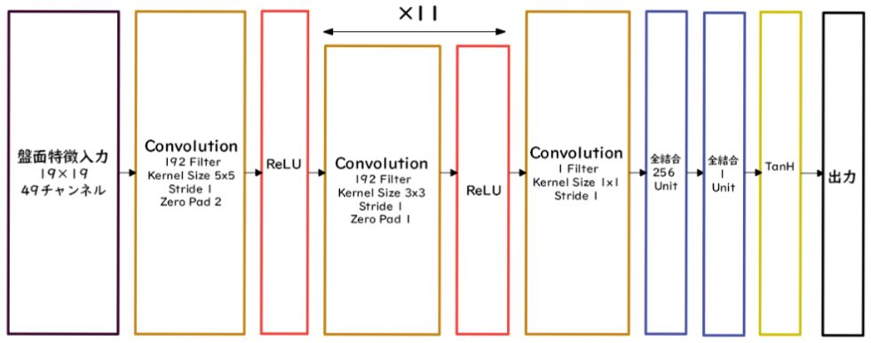

# 深層学習Day4 第二章 AlphaGo


## 特徴
- 局面の勝率を評価するモデル(value networks)と、着手の勝率を評価するモデル (policy networks)が別々に構築されている

- プロの棋譜と、自己対決（強化学習）によりモデル（CNN）の精度を向上させている
- モンテカルロ木を活用し、一手打つたびに、他の候補手も学習データとするという手法を活用
    - 勝敗をz、ネットワークが出力する盤面の評価値をv、モンテカルロ木探索の出す確率をπ、ネットワークが出力する「どこに石を置くか」の確率をp、パラメータをθとした時に下記を最小化するようにしている


```
l = (z – v)^2 – πlogp + c|θ|^2
```


## AlphaGoの学習は以下のステップで行われる
1. 教師あり学習によるRollOutPolicyとPolicyNetの学習
1. 強化学習によるPolicyNetの学習
1. 強化学習によるValueNetの学習


## PolicyNetの教師あり学習

<br>



<br>

- KGS Go Server（ネット囲碁対局サイト）の棋譜データから3000万局面分の教師を用意し、教師と同じ着手を予測できるよう学習を行った
- 上記をminibatch size 128で1万回実施

## ValueNetの学習

<br>



<br>

1. まずSL PolicyNet(教師あり学習で作成したPolicyNet)でN手まで打つ。
1. N+1手目の手をランダムに選択し、その手で進めた局面をS（N+1）とする。
1. S（N+1）からRLPolicyNet（強化学習で作成したPolicyNet）で終局まで打ち、その勝敗報酬をRとする
1. S(N+1）とRを教師データ対とし、損失関数を平均二乗誤差とし、回帰問題として学習した。

- 以上をminibatch size 32で5000万回実施

## モンテカルロ木探索
- 現局面から末端局面までPlayOutと呼ばれるランダムシミュレーションを多数回行い、その勝敗を集計して着手の優劣を決定
- 該当手のシミュレーション回数が一定数を超えたら、その手を着手したあとの局面をシミュレーション開始局面とするよう、探索木を成長させる


## AlphaGo(Lee) とAlphaGoZeroの違い
- 教師あり学習を一切行わず、強化学習のみで作成
- 特徴入力からヒューリスティックな要素を排除し、石の配置のみにした
- PolicyNetとValueNetを１つのネットワークに統合した
- Residual Net（後述）を導入した
- モンテカルロ木探索からRollOutシミュレーションをなくした


---

# ハンズオン

- 該当するハンズオンはなし

---

# 気づき
- 講義では当然、機能面に絞った内容ですが、実際運用するとなるとどれくらいのハードウェアが必要になるか、動作し続けるにはどれほどの費用が必要か、などは重要な要素となる。
- 以下のサイトで詳しく解説されているのでご一読願う。
- 例として、ハードウェアだけで120億円は必要との計算。それにランニングコストが上乗せされる形となる。
- [アルファ碁ゼロ（AlphaGoZero）ってお金かかってるなあ・・という素直な驚き](https://arakan-pgm-ai.hatenablog.com/entry/2019/01/12/100000)
- [AlphaGo - Wikipedia](https://ja.wikipedia.org/wiki/AlphaGo)