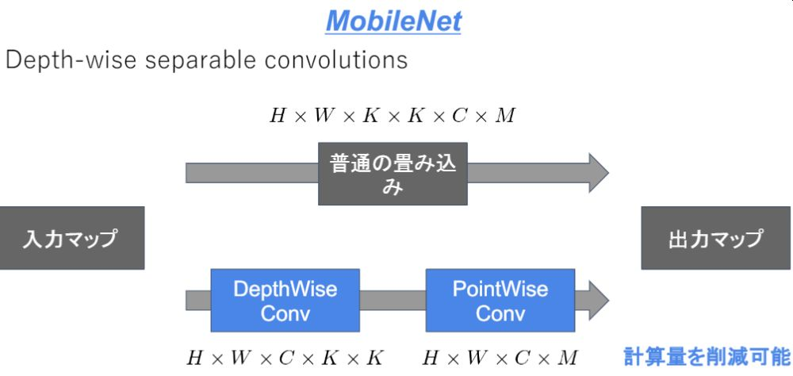

# 深層学習Day4 第四章 応用モデル

## ディープラーニングは計算量が概ね多い
- ディープラーニングモデルは精度は良いが、その分ネットワークが深くなり計算量が増える。
- 計算量が増えると、多くの計算リソースが必要で、お金がかかってしまう。
- ディープラーニングモデルの軽量化・高速化・高精度化を実現
- その名の通りMobileNets

## MobileNetsは計算量を少なくする
- 例えば一般的な畳み込みレイヤーは計算量が多い
- Depthwise ConvolutionとPointwise Convolutionの組み合わせで軽量化を実現

 

 

## Residual Network（以下、ResNet）
- Dense Convolutional Network（以下、DenseNet）というCNNは層が深くなるにつれて、学習が難しくなるという問題があった
- ResNetにより前方の層から後方の層へアイデンティティ接続を介してパスを作ることで問題を対処した

- DenseNetとResNetの違い
    - DenseBlockでは前方の各層からの出力全てが後方の層への入力として用いられる
    - RessidualBlockでは前1層の入力のみ後方の層へ入力

---

# ハンズオン

- 該当するハンズオンはなし

---

# 気づき
- 負荷軽減はどの世界のIT業界にもあるものだな、と思った。どうして初めにリリースしたプログラムっていうのは負荷が最も重いパターンで登場してしまうのだろう。
