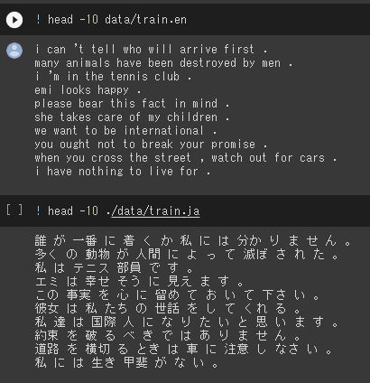
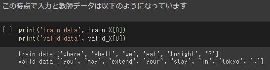
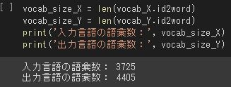
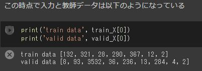
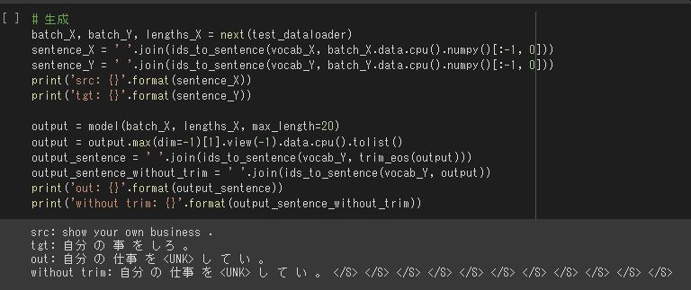
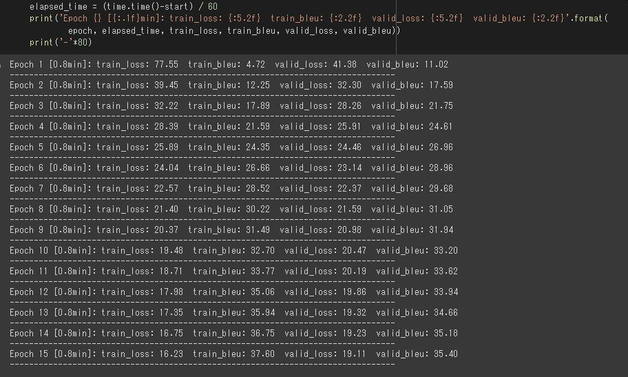
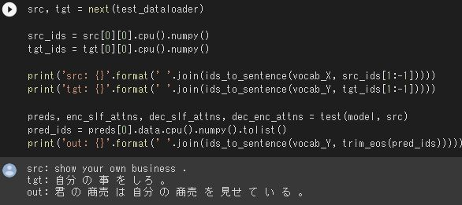
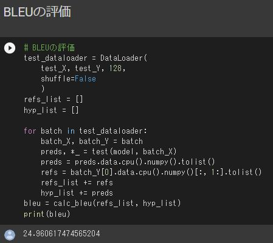

# 深層学習Day4 第五章 Transformer

## Seq2seqの復習

- 系列(Sequence)を入力として、系列を出力するもの
- Encoder-Decoderモデルとも呼ばれる
- 入力系列がEncode(内部状態に変換)され、内部状態からDecode(系列に変換)する
- 実応用上も、入力・出力共に系列情報なものは多い
    - 翻訳 (英語→日本語) 
    - 音声認識 (波形→テキスト) 
    - チャットボット (テキスト→テキスト)

## Seq2seqは言語モデルを2つ連結した形
- RNN
- LSTM

## RNN x 言語モデルまとめ
- RNNは系列情報を内部状態に変換することができる 
- 文章の各単語が現れる際の同時確率は、事後確率で分解できる 
    - したがって、事後確率を求めることがRNNの目標になる 
- 言語モデルを再現するようにRNNの重みが学習されていれば、ある時点の次の単語を予測することができる 
    - 先頭単語を与えれば文章を生成することも可能

## Seq2seqはEncoderからDecoderに渡される内部状態ベクトルが重要
- Decoder側の構造は言語モデルRNNとほぼ同じだが 隠れ状態の初期値にEncoder側の内部状態を受け取る
- Decoderのoutput側に正解を当てれば教師あり学習がEnd2endで行える

## NN機械翻訳の問題
    - 文長が長くなると表現力が足りなくなる

## Attention (注意機構)モデル
- 翻訳先の各単語を選択する際に、翻訳元の文中の各単語の隠れ状態を利用
- 文長が長くなっても翻訳精度が落ちないことが確認できる

## Attentionは何をしているのか
- Attentionは辞書オブジェクト
- query(検索クエリ)に一致するkeyを索引し、対応するvalueを取り出す操作であると見做すことができる。これは辞書オブジェクトの機能と同じである

## Transformer
- 2017年6月に登場 - RNNを使わない 
- 必要なのはAttentionだけ 
- 当時のSOTAをはるかに少ない計算量で実現 
- 英仏 (3600万文) の学習を8GPUで3.5日で完了

---

# ハンズオン

- lecture_chap1_exercise_public.ipynbを実行

- 結果

 

 

 

 

 

 

- lecture_chap2_exercise_public.ipynbを実行

- 結果

 

 

 

 

---

# 気づき
- 個人的には画像処理分野よりも自然言語処理分野の方が面白く話を聞ける。ただ、画像処理の方は視覚的なイメージを元に理解することができるが、言語の方はイメージを持つことがなかなか難しいと思った。
