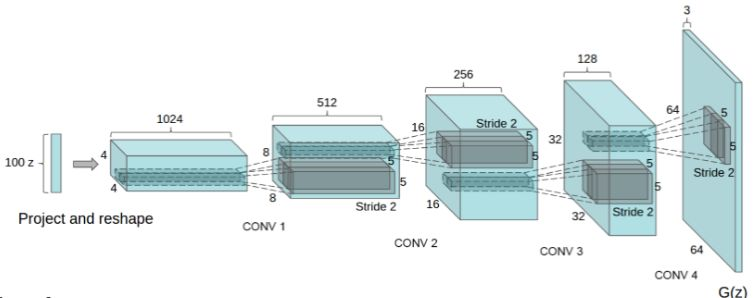

# 深層学習Day4 第四章 応用モデル

## GAN(Generative Adversarial Nets)とは
- 生成器と識別器を競わせて学習する生成&識別モデル
    - Generator:乱数からデータを生成
    - Discriminator: 入力データが真データ(学習データ)であるかを識別
- 2プレイヤー（GeneratorとDiscriminator）のミニマックスゲーム
    - 1人が自分の勝利する確率を最大化する作戦を取る
    - もう一人は相手が勝利する確率を最小化する作戦を取る

## GAN最適化方法
- Discriminator実行
    - Generatorのパラメータ𝜃gを固定
    - 真データと生成データを𝑚個ずつサンプル
    - 𝜃gを勾配上昇法(Gradient Ascent)で更新

- Generator実行
    - Discriminatorのパラメータ𝜃dを固定
    - 生成データを𝑚個ずつサンプル
    - 𝜃gを勾配降下法(Gradient Descent)で更新

## DCGAN(Deep Convolutional GAN)
- GANを利用した画像生成モデル
- いくつかの構造制約により生成品質を向上

- Generator
    - Pooling層の代わりに転置畳み込み層を使用
    - 最終層はtanh、その他はReLU関数で活性化
- Discriminator
    - Pooling層の代わりに畳み込み層を使用
    - Leaky ReLU関数で活性化

## DCGANのネットワーク構造
- Generator
    - 転置畳み込み層により乱数を画像にアップサンプリング

 

 

- Discriminator
    - 畳み込み層により画像から特徴量を抽出し、最終層をsigmoid関数で活性化

---

# ハンズオン

- 該当するハンズオンはなし

---

# 気づき
- 本物側の学習と偽物側の学習をお互いにすすめるというアイデアが面白いと思った。偽物学習ネットワークを複数持つようなモデルってあるのだろうか。
